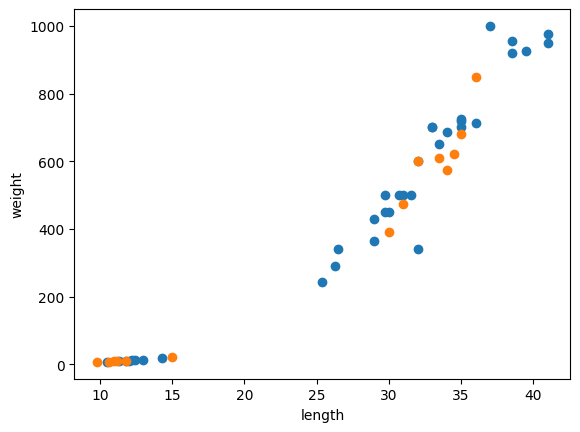

<div align="center">

# 🎲 02-1. 훈련 세트와 테스트 세트

### 샘플링 편향을 확인하고 데이터를 올바르게 나누기

[](https://www.python.org/)
[](https://numpy.org/)
[](https://scikit-learn.org/)

<br>

[`02_01_train_test_set.ipynb`](./02_01_train_test_set.ipynb)

**핵심 주제:** 훈련 세트 · 테스트 세트 · 샘플링 편향 · NumPy 배열 인덱싱

</div>

---

## 실습 목적

도미 35마리와 빙어 14마리가 순서대로 저장된 데이터를 이용해  
KNN 모델의 훈련 세트와 테스트 세트를 구성합니다.

처음에는 데이터를 순서대로 잘라 다음처럼 나눕니다.

```text
훈련 세트: 도미 35마리
테스트 세트: 빙어 14마리
```

모델은 도미만 학습했기 때문에 테스트에 등장한 빙어를 하나도 맞히지 못합니다.

이후 전체 샘플의 **인덱스를 무작위로 섞고**, 입력과 타깃에 동일한 인덱스를 적용해  
훈련 세트와 테스트 세트 양쪽에 도미와 빙어가 함께 포함되도록 수정합니다.

---

## 핵심 결과

| 분할 방식 | 훈련 데이터 | 테스트 데이터 | 정확도 |
|---|---|---|---:|
| 순서대로 분할 | 도미만 포함 | 빙어만 포함 | `0.0` |
| 인덱스를 섞어 분할 | 도미·빙어 혼합 | 도미·빙어 혼합 | `1.0` |

정확도가 달라진 이유는 모델 알고리즘이 바뀌어서가 아니라  
**훈련 데이터가 전체 데이터의 특성을 제대로 대표하게 되었기 때문**입니다.

---

# 코드와 결과

## 1. 입력과 타깃 만들기

```python
fish_data = [[l, w] for l, w in zip(fish_length, fish_weight)]
fish_target = [1] * 35 + [0] * 14
```

- `fish_data`는 생선 한 마리를 `[길이, 무게]` 형태로 저장합니다.
- 도미는 `1`, 빙어는 `0`으로 표시합니다.
- 입력과 타깃의 같은 인덱스가 같은 생선을 나타냅니다.

```text
fish_data[0] ↔ fish_target[0]
fish_data[1] ↔ fish_target[1]
```

---

## 2. 데이터를 순서대로 나눈 잘못된 분할

```python
train_input = fish_data[:35]
train_target = fish_target[:35]

test_input = fish_data[35:]
test_target = fish_target[35:]
```

슬라이싱에서 종료 인덱스는 포함되지 않습니다.

```text
[:35]  → 인덱스 0~34
[35:]  → 인덱스 35~끝
```

원본 데이터는 도미가 앞에, 빙어가 뒤에 정렬되어 있습니다.

따라서 위 코드의 결과는 다음과 같습니다.

```text
train_input  → 도미 35마리
test_input   → 빙어 14마리
```

---

## 3. 잘못 나눈 데이터로 학습

```python
kn.fit(train_input, train_target)
kn.score(test_input, test_target)
```

결과:

```text
0.0
```

모델은 훈련 과정에서 도미 클래스 `1`만 보았습니다.  
빙어의 길이와 무게를 학습한 적이 없으므로 테스트의 빙어를 모두 잘못 분류합니다.

이처럼 훈련 세트와 테스트 세트가 전체 데이터를 고르게 대표하지 못하는 현상을  
**샘플링 편향**이라고 합니다.

---

## 4. NumPy 배열로 변환

```python
input_arr = np.array(fish_data)
target_arr = np.array(fish_target)
```

NumPy 배열을 사용하면 여러 행을 인덱스 배열로 한 번에 선택할 수 있습니다.

```python
print(input_arr.shape)
```

결과:

```text
(49, 2)
```

- `49`: 생선 샘플 수
- `2`: 길이와 무게 특성 수

머신러닝의 입력 배열은 일반적으로 다음 구조입니다.

```text
(샘플 수, 특성 수)
```

---

## 5. 샘플 인덱스 섞기

```python
np.random.seed(42)
index = np.arange(49)
np.random.shuffle(index)
```

### `np.random.seed(42)`

무작위 결과를 고정합니다.  
같은 코드를 다시 실행해도 같은 순서로 섞입니다.

### `np.arange(49)`

```text
[0, 1, 2, ..., 48]
```

전체 샘플의 위치를 나타내는 인덱스 배열을 만듭니다.

### `np.random.shuffle(index)`

인덱스의 순서만 무작위로 변경합니다.

입력과 타깃을 각각 따로 섞지 않고 **인덱스 하나만 섞는 이유**는  
입력 샘플과 정답의 대응을 유지하기 위해서입니다.

---

## 6. 같은 인덱스로 훈련 세트 만들기

```python
train_input = input_arr[index[:35]]
train_target = target_arr[index[:35]]
```

- 섞인 인덱스의 앞 35개를 훈련 세트로 사용합니다.
- 입력과 타깃에 같은 `index[:35]`를 적용합니다.
- 따라서 각 생선과 정답의 연결이 유지됩니다.

```python
print(input_arr[13], train_input[0])
```

결과:

```text
[32. 340.] [32. 340.]
```

섞인 인덱스의 첫 값이 `13`이므로  
새 훈련 세트의 첫 샘플은 원본의 13번 샘플과 같습니다.

---

## 7. 나머지 샘플로 테스트 세트 만들기

```python
test_input = input_arr[index[35:]]
test_target = target_arr[index[35:]]
```

- 앞의 35개를 제외한 나머지 14개를 테스트 세트로 사용합니다.
- 훈련 세트와 테스트 세트가 서로 겹치지 않습니다.

```text
훈련 세트: 35개
테스트 세트: 14개
전체: 49개
```

---

## 8. 훈련 세트와 테스트 세트 확인

```python
plt.scatter(train_input[:, 0], train_input[:, 1])
plt.scatter(test_input[:, 0], test_input[:, 1])
plt.xlabel('length')
plt.ylabel('weight')
plt.show()
```

### `train_input[:, 0]`

- `:`는 모든 행
- `0`은 첫 번째 열
- 모든 훈련 샘플의 길이를 선택합니다.

### `train_input[:, 1]`

모든 훈련 샘플의 무게를 선택합니다.

테스트 세트도 같은 방식으로 표시합니다.



두 색상 모두 도미 영역과 빙어 영역에 분포합니다.  
즉, 훈련 세트와 테스트 세트 양쪽에 두 종류의 생선이 포함되었습니다.

---

## 9. 다시 학습하고 평가

```python
kn.fit(train_input, train_target)
kn.score(test_input, test_target)
```

결과:

```text
1.0
```

모델이 훈련 과정에서 도미와 빙어를 모두 학습했기 때문에  
테스트 샘플 14개를 모두 올바르게 분류했습니다.

다만 데이터가 작고 두 클래스가 뚜렷하게 분리되어 있으므로  
이 결과가 모든 새로운 생선에서 100% 정확도를 보장하는 것은 아닙니다.

---

# 꼭 기억할 내용

### 입력과 타깃은 반드시 함께 움직여야 한다

잘못된 방법:

```python
np.random.shuffle(input_arr)
np.random.shuffle(target_arr)
```

두 배열을 따로 섞으면 생선과 정답의 연결이 깨질 수 있습니다.

올바른 방법:

```python
index = np.arange(49)
np.random.shuffle(index)

input_arr[index]
target_arr[index]
```

### 데이터 순서를 확인해야 한다

클래스별로 정렬된 데이터를 단순히 앞뒤로 나누면  
한 클래스가 특정 세트에 몰릴 수 있습니다.

### 테스트 세트는 학습에 사용하지 않는다

테스트 세트는 모델이 처음 보는 데이터에서 얼마나 잘 작동하는지 확인하기 위한 자료입니다.

---

## 다음 학습과 연결

```text
02-1 훈련 세트와 테스트 세트
→ 인덱스를 섞어 데이터 분할

02-2 데이터 전처리
→ train_test_split으로 간편하게 분할
→ stratify로 클래스 비율 유지
→ 특성 스케일 표준화
```

---

## 출처

『혼자 공부하는 머신러닝+딥러닝』을 학습하며 직접 실행한 코드와 결과를 정리했습니다.  
교재 본문과 그림을 재배포하지 않으며, 개인 학습 기록을 목적으로 합니다.
