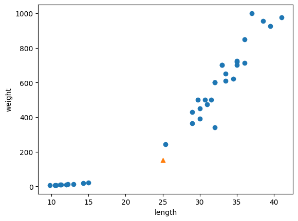
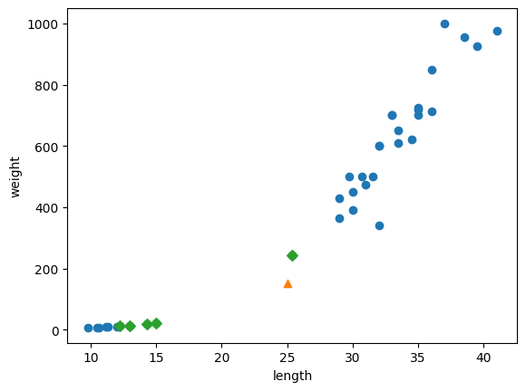
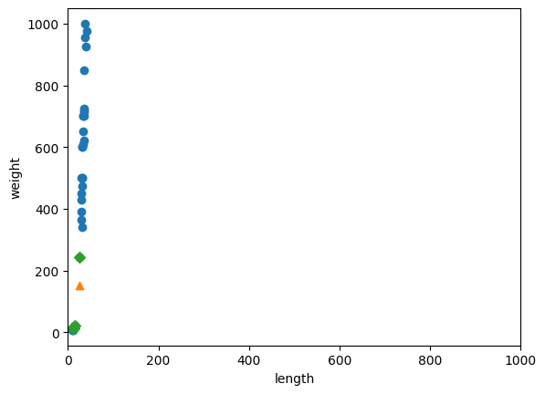
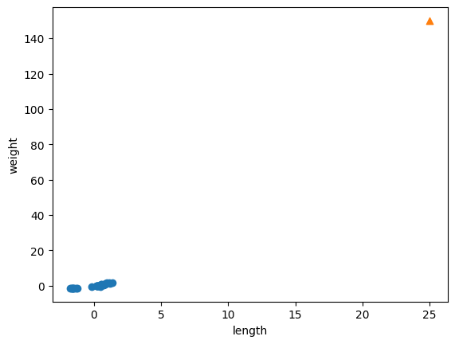
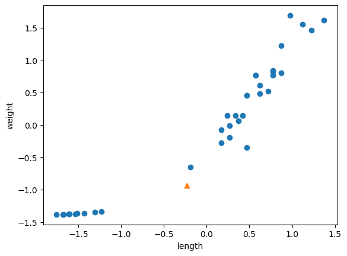
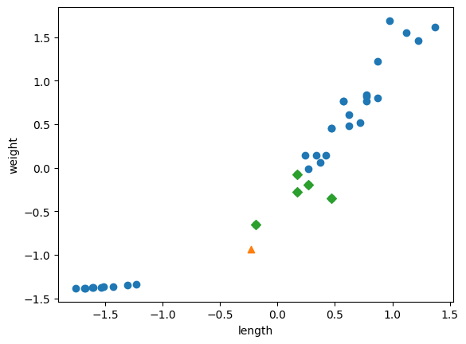

<div align="center">

# ⚖️ 02-2. 데이터 전처리

### 특성 스케일이 KNN 예측에 미치는 영향과 표준화

[](https://www.python.org/)
[](https://numpy.org/)
[](https://scikit-learn.org/)

<br>

[`02_02_data_preprocessing.ipynb`](./02_02_data_preprocessing.ipynb)

**핵심 주제:** `train_test_split` · 층화 추출 · 거리 기반 모델 · 표준점수

</div>

---

## 실습 목적

생선의 **길이**와 **무게**를 이용해 도미와 빙어를 분류합니다.

처음에는 길이 25cm, 무게 150g인 생선을 KNN 모델이 빙어로 잘못 분류합니다.  
원인은 길이보다 무게의 숫자 범위가 훨씬 커서, 거리 계산에서 무게가 지나치게 큰 영향을 주기 때문입니다.

이 실습에서는 다음 순서로 문제를 해결합니다.

```text
데이터 구성
→ 훈련·테스트 세트 분리
→ 잘못된 예측 확인
→ 가까운 이웃과 거리 분석
→ 훈련 세트 기준 표준화
→ 모델 재학습
→ 올바른 예측 확인
```

---

## 핵심 결과

| 항목 | 전처리 전 | 표준화 후 |
|---|---:|---:|
| 테스트 정확도 | `1.0` | `1.0` |
| `[25, 150]` 예측 | 빙어 `0` | 도미 `1` |
| 이웃 선정 기준 | 무게 차이에 크게 지배됨 | 길이와 무게를 비슷한 기준으로 비교 |

테스트 정확도가 원래부터 `1.0`이어도 새 샘플 하나를 잘못 예측할 수 있습니다.  
따라서 전체 정확도뿐 아니라 **개별 예측과 데이터 전처리의 타당성**도 확인해야 합니다.

---

# 코드와 결과

## 1. 입력 데이터 만들기

```python
fish_data = np.column_stack((fish_length, fish_weight))
```

- `fish_length`와 `fish_weight`를 열 방향으로 붙입니다.
- 한 행이 생선 한 마리입니다.
- 첫 번째 열은 길이, 두 번째 열은 무게입니다.
- 결과 형태는 `(49, 2)`입니다.

간단한 예:

```python
np.column_stack(([1, 2, 3], [4, 5, 6]))
```

결과:

```text
[[1, 4],
 [2, 5],
 [3, 6]]
```

```python
fish_target = np.concatenate((np.ones(35), np.zeros(14)))
```

- 도미 35마리의 정답을 `1`로 만듭니다.
- 빙어 14마리의 정답을 `0`으로 만듭니다.
- `concatenate()`로 두 배열을 이어 붙입니다.

---

## 2. 훈련 세트와 테스트 세트 나누기

```python
train_input, test_input, train_target, test_target = train_test_split(
    fish_data,
    fish_target,
    random_state=42
)
```

`train_test_split()`은 입력과 타깃을 같은 순서로 섞어 훈련·테스트 세트로 나눕니다.

- `fish_data`: 전체 입력
- `fish_target`: 전체 정답
- `random_state=42`: 실행할 때마다 같은 분할을 재현

기본 분할 결과의 테스트 타깃은 클래스 비율이 조금 치우쳤습니다.

```text
[1, 0, 0, 0, 1, 1, 1, 1, 1, 1, 1, 1, 1]
```

그래서 다음처럼 층화 추출을 사용합니다.

```python
train_input, test_input, train_target, test_target = train_test_split(
    fish_data,
    fish_target,
    stratify=fish_target,
    random_state=42
)
```

`stratify=fish_target`은 전체 데이터의 도미·빙어 비율을 훈련 세트와 테스트 세트에도 비슷하게 유지합니다.

---

## 3. 첫 번째 KNN 모델

```python
kn = KNeighborsClassifier()
kn.fit(train_input, train_target)
kn.score(test_input, test_target)
```

- 기본 이웃 수는 5입니다.
- 테스트 정확도는 `1.0`입니다.

하지만 새로운 생선을 예측하면 문제가 생깁니다.

```python
kn.predict([[25, 150]])
```

결과:

```text
[0.]
```

길이 25cm, 무게 150g인 생선을 **빙어**로 예측했습니다.



삼각형이 새로운 생선입니다. 눈으로 보면 도미 집단에 가까워 보이지만 KNN의 계산 결과는 달랐습니다.

---

## 4. 가장 가까운 이웃 확인

```python
distances, indexes = kn.kneighbors([[25, 150]])
```

- `distances`: 새 생선과 가장 가까운 5개 샘플까지의 거리
- `indexes`: 그 샘플들이 훈련 세트에서 위치한 인덱스

```python
print(train_input[indexes])
```

결과:

```text
[[[25.4, 242.0],
  [15.0,  19.9],
  [14.3,  19.7],
  [13.0,  12.2],
  [12.2,  12.2]]]
```

가까운 이웃 5개 중 도미는 1개, 빙어는 4개입니다.  
따라서 다수결에 의해 빙어로 예측됩니다.



마름모가 모델이 선택한 이웃입니다.

---

## 5. 왜 눈으로 본 거리와 계산 결과가 다른가?

```python
plt.xlim((0, 1000))
```

x축도 y축과 비슷한 범위로 넓혀 보면 이유가 드러납니다.



원래 특성 범위는 대략 다음과 같습니다.

```text
길이: 약 10~40
무게: 약 7~1000
```

KNN의 유클리드 거리는 두 특성의 차이를 함께 계산합니다.

```text
거리 = √((길이 차이)² + (무게 차이)²)
```

무게의 차이가 수백 단위인 반면 길이 차이는 수십 단위이므로,  
거리 계산에서는 무게가 사실상 대부분을 결정합니다.

---

## 6. 평균과 표준편차 계산

```python
mean = np.mean(train_input, axis=0)
std = np.std(train_input, axis=0)
```

`axis=0`은 각 열별로 계산한다는 뜻입니다.

```text
평균: [27.2972, 454.0972]
표준편차: [9.9824, 323.2989]
```

- 첫 번째 값: 길이의 평균 또는 표준편차
- 두 번째 값: 무게의 평균 또는 표준편차

---

## 7. 훈련 세트 표준화

```python
train_scaled = (train_input - mean) / std
```

각 값을 표준점수로 변환합니다.

```text
표준점수 = (원래 값 - 평균) / 표준편차
```

표준화 후에는 길이와 무게 모두 평균이 0에 가깝고 표준편차가 1에 가까운 기준으로 비교됩니다.

### 주의: 새 샘플도 같은 방식으로 바꿔야 함

아래 그래프는 훈련 데이터만 표준화하고 새 생선 `[25, 150]`은 원래 값으로 표시한 잘못된 예입니다.



서로 다른 좌표계를 한 그래프에서 비교한 셈이므로 의미가 없습니다.

새 생선도 훈련 세트의 평균과 표준편차로 변환합니다.

```python
new = ([25, 150] - mean) / std
```



이제 훈련 데이터와 새 생선이 같은 기준으로 표현됩니다.

---

## 8. 표준화된 데이터로 다시 학습

```python
kn.fit(train_scaled, train_target)
```

표준화한 훈련 세트로 KNN 모델을 다시 학습합니다.

테스트 세트도 **훈련 세트에서 계산한 평균과 표준편차**를 사용합니다.

```python
test_scaled = (test_input - mean) / std
kn.score(test_scaled, test_target)
```

결과:

```text
1.0
```

테스트 세트 자체에서 평균과 표준편차를 새로 계산하면 안 됩니다.  
평가 데이터의 정보를 전처리에 사용하면 데이터 누수가 생길 수 있기 때문입니다.

---

## 9. 새 생선 다시 예측

```python
kn.predict([new])
```

결과:

```text
[1.]
```

표준화 후에는 새 생선을 **도미**로 올바르게 예측합니다.

```python
distances, indexes = kn.kneighbors([new])
```



표준화 후 선택된 최근접 이웃들은 새 생선 주변의 도미 샘플들입니다.

---

# 꼭 기억할 내용

### 거리 기반 모델에서는 특성 스케일이 중요하다

KNN, K-means, SVM처럼 거리를 활용하는 알고리즘은 특성의 숫자 범위가 다르면 큰 범위의 특성에 지배될 수 있습니다.

### 평균과 표준편차는 훈련 세트에서만 계산한다

```python
mean = np.mean(train_input, axis=0)
std = np.std(train_input, axis=0)

train_scaled = (train_input - mean) / std
test_scaled = (test_input - mean) / std
new = ([25, 150] - mean) / std
```

훈련, 테스트, 새로운 샘플 모두 **동일한 기준**을 사용해야 합니다.

### 높은 정확도만으로 모델이 완벽하다고 판단하면 안 된다

이 실습에서는 전처리 전후 모두 테스트 정확도가 `1.0`이지만  
특정 새 샘플의 예측은 전처리 여부에 따라 달라졌습니다.

---

## 다음 학습과 연결

```text
02-1 훈련 세트와 테스트 세트
→ 데이터를 무작위로 나누기

02-2 데이터 전처리
→ 층화 추출과 특성 표준화

03-1 k-최근접 이웃 회귀
→ 분류가 아닌 연속값 예측
```

---

## 출처

『혼자 공부하는 머신러닝+딥러닝』을 학습하며 직접 실행한 코드와 결과를 정리했습니다.  
교재 본문과 그림을 재배포하지 않으며, 이 저장소는 개인 학습 기록을 목적으로 합니다.
