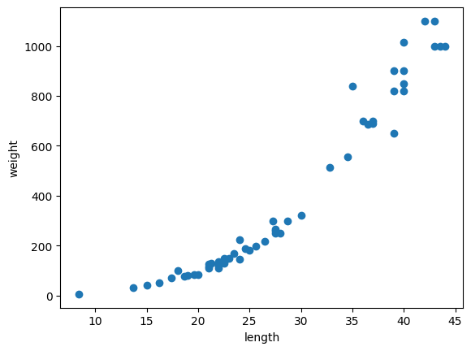

<div align="center">

# 📏 03-1. k-최근접 이웃 회귀

### 농어의 길이로 무게 예측하기

[](https://www.python.org/)
[](https://numpy.org/)
[](https://scikit-learn.org/)

<br>

[`03_01_knn_regression.ipynb`](./03_01_knn_regression.ipynb)

**핵심 주제:** 회귀 · 배열 차원 변환 · 결정계수 · 평균 절댓값 오차 · 과소적합

</div>

---

## 실습 목적

농어의 **길이**를 입력으로 사용해 **무게**를 예측합니다.

앞 장에서는 도미와 빙어처럼 정해진 범주를 맞히는 분류를 다뤘지만,  
이번에는 무게처럼 연속적인 숫자를 예측하는 **회귀 문제**를 다룹니다.

k-최근접 이웃 회귀는 새로운 샘플과 가장 가까운 이웃들의 타깃값을 찾아  
그 평균을 예측값으로 사용합니다.

---

## 핵심 결과

| 모델 설정 | 훈련 \(R^2\) | 테스트 \(R^2\) |
|---|---:|---:|
| 기본값 `n_neighbors=5` | `0.9699` | `0.9928` |
| 조정값 `n_neighbors=3` | `0.9805` | `0.9746` |

기본 모델에서는 테스트 점수가 훈련 점수보다 높아 과소적합 가능성이 보였습니다.  
이웃 수를 3으로 줄이자 모델이 훈련 데이터의 변화를 조금 더 세밀하게 반영했습니다.

테스트 세트의 평균 절댓값 오차는 약 **19.16g**입니다.

---

# 코드와 결과

## 1. 농어 데이터 확인

```python
perch_length = np.array([...])
perch_weight = np.array([...])
```

- `perch_length`: 농어의 길이
- `perch_weight`: 같은 농어의 무게
- 같은 인덱스의 길이와 무게가 한 샘플을 이룹니다.

```text
perch_length[0] ↔ perch_weight[0]
```

농어의 길이와 무게를 산점도로 확인합니다.

```python
plt.scatter(perch_length, perch_weight)
plt.xlabel('length')
plt.ylabel('weight')
plt.show()
```



농어의 길이가 길어질수록 무게도 전반적으로 증가합니다.  
직선처럼 완전히 일정하지는 않지만 두 변수 사이에 뚜렷한 관계가 보입니다.

---

## 2. 훈련 세트와 테스트 세트 분리

```python
train_input, test_input, train_target, test_target = train_test_split(
    perch_length,
    perch_weight,
    random_state=42
)
```

- 농어 길이는 입력 데이터입니다.
- 농어 무게는 예측할 타깃입니다.
- `random_state=42`로 분할 결과를 고정합니다.
- 전체 56개 샘플이 훈련 42개, 테스트 14개로 나뉩니다.

---

## 3. 배열 차원 바꾸기

처음의 입력 데이터는 1차원 배열입니다.

```python
test_array = np.array([1, 2, 3, 4])
print(test_array.shape)
```

결과:

```text
(4,)
```

이를 2행 2열로 바꾸면 다음과 같습니다.

```python
test_array = test_array.reshape(2, 2)
print(test_array.shape)
```

결과:

```text
(2, 2)
```

scikit-learn의 입력 데이터는 일반적으로 다음 형태여야 합니다.

```text
(샘플 수, 특성 수)
```

농어 데이터는 특성이 길이 하나뿐이므로 열이 1개인 2차원 배열로 바꿉니다.

```python
train_input = train_input.reshape(-1, 1)
test_input = test_input.reshape(-1, 1)
```

결과:

```text
train_input.shape → (42, 1)
test_input.shape  → (14, 1)
```

### `reshape(-1, 1)`의 의미

- `1`: 열을 1개로 지정
- `-1`: 전체 원소 수에 맞게 행 수를 자동 계산

따라서 원소를 잃거나 추가하지 않고 세로 방향의 2차원 배열로 바뀝니다.

---

## 4. KNN 회귀 모델 학습

```python
from sklearn.neighbors import KNeighborsRegressor

knr = KNeighborsRegressor()
knr.fit(train_input, train_target)
```

기본 이웃 수는 5입니다.

새로운 농어의 길이가 입력되면 가장 가까운 농어 5마리를 찾고,  
그 농어들의 무게 평균을 예측값으로 사용합니다.

---

## 5. 테스트 세트 평가

```python
knr.score(test_input, test_target)
```

결과:

```text
0.992809406101064
```

회귀 모델의 `score()`는 기본적으로 **결정계수 \(R^2\)**를 반환합니다.

```text
R²가 1에 가까울수록 실제 타깃의 변화를 잘 설명
R²가 0이면 평균값으로 예측한 수준
R²가 음수이면 평균값 예측보다도 성능이 낮음
```

이 모델의 테스트 점수는 약 `0.9928`로 높습니다.

---

## 6. 평균 절댓값 오차 확인

```python
test_prediction = knr.predict(test_input)
mae = mean_absolute_error(test_target, test_prediction)
print(mae)
```

결과:

```text
19.157142857142862
```

평균 절댓값 오차(MAE)는 실제 무게와 예측 무게 차이의 절댓값을 평균한 값입니다.

이 모델의 예측은 테스트 세트에서 실제 무게와 평균적으로 약 **19.16g** 차이가 납니다.

`R²`는 전체 변화를 얼마나 잘 설명하는지 보여주고,  
`MAE`는 오차가 실제 단위인 g으로 얼마나 되는지 보여줍니다.

---

## 7. 훈련 점수와 테스트 점수 비교

```python
knr.score(train_input, train_target)
```

결과:

```text
0.9698823289099254
```

기본 모델의 점수는 다음과 같습니다.

```text
훈련 점수: 0.9699
테스트 점수: 0.9928
```

일반적으로 모델은 학습에 사용한 훈련 데이터에서 더 높은 점수를 보이기 쉽습니다.  
그런데 이 모델은 테스트 점수가 더 높으므로 훈련 데이터의 패턴을 다소 단순하게 학습한  
**과소적합 가능성**을 생각할 수 있습니다.

다만 데이터셋이 작기 때문에 분할에 따른 우연한 변동도 함께 고려해야 합니다.

---

## 8. 이웃 수를 3으로 줄이기

```python
knr.n_neighbors = 3

knr.fit(train_input, train_target)
```

이웃 수를 줄이면 더 가까운 샘플들의 영향을 크게 받습니다.  
따라서 모델이 데이터의 국소적인 변화를 더 세밀하게 반영합니다.

훈련 점수:

```python
knr.score(train_input, train_target)
```

```text
0.9804899950518966
```

테스트 점수:

```python
knr.score(test_input, test_target)
```

```text
0.9746459963987609
```

정리하면:

```text
훈련 점수: 0.9805
테스트 점수: 0.9746
```

훈련 점수가 올라가고 테스트 점수와의 차이도 크지 않아  
기본 모델보다 훈련 데이터의 특성을 조금 더 잘 반영한 상태입니다.

---

# 꼭 기억할 내용

### 분류와 회귀의 차이

```text
분류 → 도미 또는 빙어처럼 범주 예측
회귀 → 무게처럼 연속된 숫자 예측
```

### KNN 회귀의 예측 방식

```text
새 샘플 입력
→ 가장 가까운 k개 샘플 탐색
→ 이웃들의 타깃 평균 계산
→ 평균값을 예측값으로 반환
```

### 모델 평가는 여러 지표로 확인한다

- `R²`: 타깃의 변화를 얼마나 설명하는지 확인
- `MAE`: 실제 단위에서 평균 오차가 얼마나 되는지 확인
- 훈련·테스트 점수 비교: 과소적합과 과대적합 가능성 확인

### 이웃 수가 모델 복잡도를 결정한다

- 이웃 수가 많음: 예측이 부드럽고 단순해짐
- 이웃 수가 적음: 데이터의 세부 변화에 민감해짐

---

## 다음 학습과 연결

```text
03-1 k-최근접 이웃 회귀
→ 가까운 샘플의 평균으로 무게 예측

03-2 선형 회귀
→ 길이와 무게의 관계를 식으로 학습
→ 훈련 범위를 벗어난 값 예측 문제 비교
```

---

## 출처

『혼자 공부하는 머신러닝+딥러닝』을 학습하며 직접 실행한 코드와 결과를 정리했습니다.  
교재 본문과 그림을 재배포하지 않으며, 개인 학습 기록을 목적으로 합니다.
