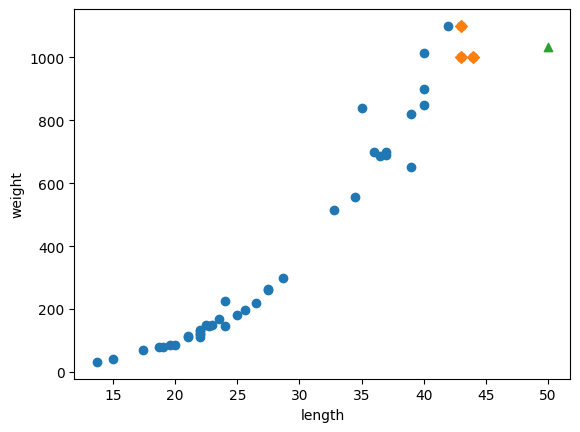
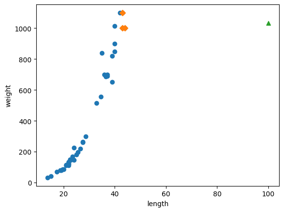
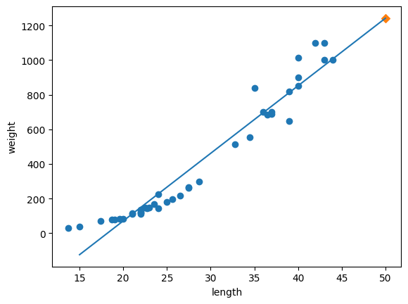
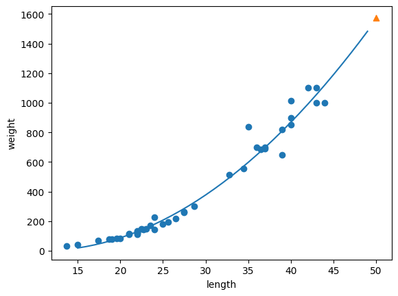

<div align="center">

# 📈 03-2. 선형 회귀

### KNN의 외삽 한계를 확인하고 선형·다항 회귀로 개선하기

[](https://www.python.org/)
[](https://numpy.org/)
[](https://scikit-learn.org/)

<br>

[`03_02_linear_regression.ipynb`](./03_02_linear_regression.ipynb)

**핵심 주제:** KNN 외삽 한계 · 선형 회귀 · 계수와 절편 · 다항 회귀

</div>

---

## 실습 목적

농어 길이로 무게를 예측할 때 KNN 회귀가 훈련 범위를 벗어난 값에서 어떤 한계를 보이는지 확인합니다.

그다음 길이와 무게의 관계를 직선으로 학습하는 선형 회귀를 적용하고,  
직선만으로는 곡선 형태의 관계를 충분히 표현하지 못한다는 점을 확인한 뒤  
길이의 제곱 항을 추가한 다항 회귀로 개선합니다.

---

## 핵심 결과

| 모델 | 50cm 예측 | 훈련 \(R^2\) | 테스트 \(R^2\) |
|---|---:|---:|---:|
| KNN 회귀 `k=3` | `1033.33g` | - | - |
| 선형 회귀 | `1241.84g` | `0.9398` | `0.8248` |
| 다항 회귀 | `1573.98g` | `0.9707` | `0.9776` |

KNN은 50cm와 100cm 농어를 모두 같은 무게로 예측했습니다.  
반면 회귀식은 입력 길이가 커질수록 예측값도 계속 변화할 수 있습니다.

---

# 코드와 결과

## 1. KNN 회귀 모델 준비

```python
knr = KNeighborsRegressor(n_neighbors=3)
knr.fit(train_input, train_target)
```

가장 가까운 농어 3마리의 무게 평균으로 새 농어의 무게를 예측합니다.

---

## 2. 길이 50cm 농어 예측

```python
knr.predict([[50]])
```

결과:

```text
1033.33g
```

가장 가까운 이웃 3개를 확인합니다.

```python
distances, indexes = knr.kneighbors([[50]])
```



- 원: 훈련 데이터
- 마름모: 가장 가까운 이웃 3개
- 삼각형: 길이 50cm 농어의 예측값

이웃 무게의 평균도 같은 값입니다.

```python
np.mean(train_target[indexes])
```

```text
1033.33g
```

KNN 회귀가 가까운 이웃들의 평균을 반환한다는 것을 직접 확인할 수 있습니다.

---

## 3. 길이 100cm 농어 예측

```python
knr.predict([[100]])
```

결과:

```text
1033.33g
```

50cm 농어와 정확히 같은 무게를 예측했습니다.



훈련 데이터에서 가장 긴 농어보다 훨씬 큰 값을 입력해도  
가장 가까운 이웃은 여전히 훈련 세트 끝부분의 같은 농어들입니다.

따라서 KNN은 훈련 범위 밖에서 예측값이 더 이상 증가하지 않습니다.

이처럼 학습한 범위를 벗어난 입력을 예측하는 것을 **외삽**이라고 하며,  
KNN은 외삽에 약한 모델입니다.

---

## 4. 선형 회귀 학습

```python
lr = LinearRegression()
lr.fit(train_input, train_target)
```

선형 회귀는 길이와 무게 사이의 관계를 다음 직선으로 학습합니다.

```text
무게 = 계수 × 길이 + 절편
```

50cm 농어 예측:

```python
lr.predict([[50]])
```

```text
1241.84g
```

학습된 계수와 절편:

```python
print(lr.coef_, lr.intercept_)
```

```text
계수: 39.0171
절편: -709.0186
```

따라서 모델이 학습한 식은 대략 다음과 같습니다.

```text
무게 = 39.02 × 길이 - 709.02
```



직선을 사용하므로 훈련 범위를 벗어난 길이에서도 무게가 계속 증가합니다.

---

## 5. 선형 회귀 성능

```python
lr.score(train_input, train_target)
lr.score(test_input, test_target)
```

결과:

```text
훈련 R²: 0.9398
테스트 R²: 0.8248
```

두 점수 모두 아주 낮지는 않지만 차이가 다소 큽니다.

또한 그래프를 보면 농어의 길이와 무게 관계가 완전한 직선이라기보다  
길이가 늘수록 무게가 더 빠르게 증가하는 곡선 형태에 가깝습니다.

선형 회귀의 절편이 음수이므로 길이가 매우 짧은 구간에서는  
음수 무게를 예측할 수 있다는 한계도 있습니다.

---

## 6. 길이의 제곱 항 추가

```python
train_poly = np.column_stack((train_input ** 2, train_input))
test_poly = np.column_stack((test_input ** 2, test_input))
```

입력 특성을 다음 두 개로 확장합니다.

```text
길이²
길이
```

배열 형태:

```text
train_poly: (42, 2)
test_poly:  (14, 2)
```

`LinearRegression`을 그대로 사용하지만 입력에 제곱 특성을 추가했기 때문에  
최종 모델은 곡선 형태를 표현할 수 있습니다.

---

## 7. 다항 회귀 학습

```python
lr.fit(train_poly, train_target)
```

50cm 농어를 예측할 때는 길이²와 길이를 함께 전달합니다.

```python
lr.predict([[50 ** 2, 50]])
```

결과:

```text
1573.98g
```

학습된 계수와 절편:

```text
계수: [1.0143, -21.5579]
절편: 116.0502
```

학습한 식은 대략 다음과 같습니다.

```text
무게 = 1.01 × 길이² - 21.56 × 길이 + 116.05
```



곡선이 농어 데이터의 증가 형태를 직선보다 자연스럽게 따라갑니다.

---

## 8. 다항 회귀 성능

```python
lr.score(train_poly, train_target)
lr.score(test_poly, test_target)
```

결과:

```text
훈련 R²: 0.9707
테스트 R²: 0.9776
```

선형 회귀보다 훈련 점수와 테스트 점수가 모두 개선되었습니다.

```text
선형 회귀 테스트 R²: 0.8248
다항 회귀 테스트 R²: 0.9776
```

훈련 점수와 테스트 점수의 차이도 크지 않아  
길이와 무게의 곡선 관계를 더 적절하게 표현한 것으로 볼 수 있습니다.

---

# 꼭 기억할 내용

### KNN은 훈련 범위 밖의 예측에 약하다

KNN은 기존 샘플의 타깃을 평균하므로  
훈련 데이터보다 훨씬 큰 입력에서도 예측값이 일정하게 머물 수 있습니다.

### 선형 회귀는 관계를 식으로 학습한다

```text
y = a × x + b
```

입력값이 훈련 범위를 벗어나도 직선을 따라 예측값을 계산할 수 있습니다.

### 다항 특성을 추가하면 곡선을 표현할 수 있다

```text
y = a × x² + b × x + c
```

알고리즘은 여전히 선형 회귀지만, 입력 특성에 제곱 항을 추가해 곡선 관계를 학습합니다.

---

## 그래프 목록

이 README에는 노트북에서 출력된 그래프 **4개를 모두 포함**했습니다.

1. 50cm 농어와 최근접 이웃
2. 100cm 농어와 최근접 이웃
3. 선형 회귀 직선
4. 다항 회귀 곡선

---

## 출처

『혼자 공부하는 머신러닝+딥러닝』을 학습하며 직접 실행한 코드와 결과를 정리했습니다.  
교재 본문과 그림을 재배포하지 않으며, 개인 학습 기록을 목적으로 합니다.
