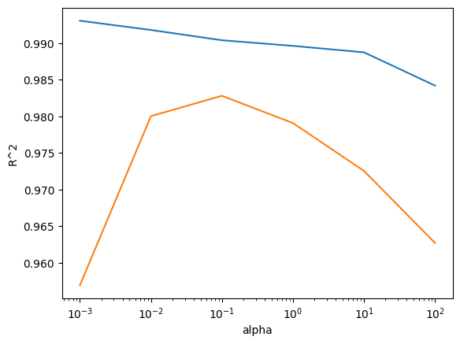
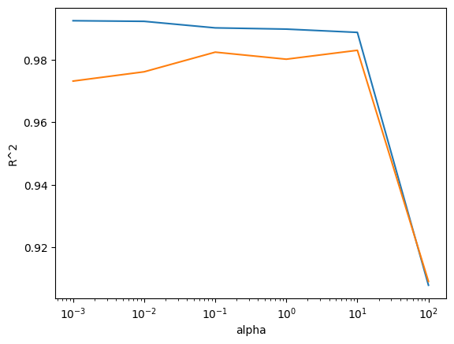

# 03-3. 특성 공학과 규제

농어의 **길이·높이·두께**를 조합해 다항 특성을 만들고, 복잡해진 회귀 모델의 과대적합을 **리지와 라쏘 규제**로 줄이는 실습입니다.

- 실습 노트북: [`03_03_feature_engineering_regularization.ipynb`](./03_03_feature_engineering_regularization.ipynb)
- 입력 특성: `length`, `height`, `width`
- 예측 대상: 농어 무게
- 핵심 모델: `LinearRegression`, `Ridge`, `Lasso`

---

## 전체 흐름

```text
원본 특성 3개 준비
→ 2차 다항 특성 9개 생성
→ 선형 회귀 성능 확인
→ 5차 다항 특성 55개 생성
→ 과대적합 확인
→ 특성 표준화
→ 리지·라쏘로 규제
→ alpha 선택
```

## 핵심 결과

| 모델 | 훈련 R² | 테스트 R² | 해석 |
|---|---:|---:|---|
| 2차 다항 선형 회귀 | `0.9903` | `0.9715` | 특성 확장으로 성능 개선 |
| 5차 다항 선형 회귀 | `1.0000` | `-144.4061` | 심각한 과대적합 |
| 리지 `alpha=1` | `0.9896` | `0.9791` | 규제로 과대적합 완화 |
| 리지 `alpha=0.1` | `0.9904` | `0.9828` | 최종 선택 |
| 라쏘 `alpha=1` | `0.9898` | `0.9801` | 규제로 과대적합 완화 |
| 라쏘 `alpha=10` | `0.9888` | `0.9824` | 최종 선택, 계수 40개 제거 |

---

## 1. 데이터 준비

```python
import pandas as pd
import numpy as np

perch_full = pd.read_csv("https://bit.ly/perch_csv_data")
perch_weight = np.array([...])
```

`pandas.read_csv()`로 길이·높이·두께가 들어 있는 표 데이터를 읽고, 무게는 NumPy 배열로 준비합니다.

```text
perch_full   → 입력 데이터
perch_weight → 정답 데이터
```

```python
from sklearn.model_selection import train_test_split

train_input, test_input, train_target, test_target = train_test_split(
    perch_full,
    perch_weight,
    random_state=42
)
```

입력과 타깃을 함께 나누므로 같은 농어의 특성과 무게가 서로 어긋나지 않습니다.  
`random_state=42`는 실행할 때마다 같은 분할 결과를 얻기 위한 값입니다.

---

## 2. 다항 특성 만들기

```python
from sklearn.preprocessing import PolynomialFeatures

poly = PolynomialFeatures(include_bias=False)
poly.fit(train_input)

train_poly = poly.transform(train_input)
test_poly = poly.transform(test_input)
```

`PolynomialFeatures`는 기존 특성의 제곱과 곱을 자동으로 만듭니다.

원본 특성:

```text
length, height, width
```

2차까지 확장하면:

```text
length
height
width
length²
length × height
length × width
height²
height × width
width²
```

```python
print(train_poly.shape)
```

```text
(42, 9)
```

- 훈련 샘플: 42개
- 변환된 특성: 9개

`include_bias=False`는 항상 값이 1인 열을 만들지 않도록 합니다. 선형 회귀 모델이 절편을 직접 학습하므로 중복되는 열이 필요하지 않습니다.

생성된 특성 이름은 다음 메서드로 확인할 수 있습니다.

```python
poly.get_feature_names_out()
```

---

## 3. 2차 다항 회귀

```python
from sklearn.linear_model import LinearRegression

lr = LinearRegression()
lr.fit(train_poly, train_target)

print(lr.score(train_poly, train_target))
print(lr.score(test_poly, test_target))
```

결과:

```text
훈련 R²: 0.9903183436982124
테스트 R²: 0.9714559911594122
```

길이 하나만 사용하는 대신 높이·두께와 조합 특성을 함께 사용해 농어 무게의 관계를 더 풍부하게 표현합니다.

회귀 모델의 `score()`는 결정계수 `R²`를 반환합니다.

```text
R²가 1에 가까움 → 실제 무게 변화를 잘 설명
R²가 0에 가까움 → 평균 무게를 예측한 수준
R²가 음수       → 평균 무게 예측보다도 나쁨
```

---

## 4. 5차 다항 특성과 과대적합

```python
poly = PolynomialFeatures(degree=5, include_bias=False)

poly.fit(train_input)
train_poly = poly.transform(train_input)
test_poly = poly.transform(test_input)

print(train_poly.shape)
```

```text
(42, 55)
```

훈련 샘플은 42개인데 특성이 55개로 늘었습니다.

```python
lr.fit(train_poly, train_target)

print(lr.score(train_poly, train_target))
print(lr.score(test_poly, test_target))
```

결과:

```text
훈련 R²: 0.999999999999815
테스트 R²: -144.40613927413557
```

훈련 데이터를 거의 완벽히 맞혔지만 테스트 성능은 크게 무너졌습니다. 특성이 지나치게 많아 모델이 훈련 데이터를 외운 **과대적합** 상태입니다.

---

## 5. 표준화

```python
from sklearn.preprocessing import StandardScaler

ss = StandardScaler()
ss.fit(train_poly)

train_scaled = ss.transform(train_poly)
test_scaled = ss.transform(test_poly)
```

5차 특성에는 `length`, `length²`, `length⁵`처럼 숫자 크기가 크게 다른 값들이 섞여 있습니다.

리지와 라쏘는 계수 크기에 벌점을 주기 때문에, 규제 전에 특성들의 범위를 비슷하게 맞춰야 합니다.

`StandardScaler`는 훈련 세트에서 각 특성의 평균과 표준편차를 구해 다음 형태로 변환합니다.

```text
(값 - 평균) / 표준편차
```

테스트 세트에서는 다시 `fit()`하지 않고 훈련 세트에서 구한 기준으로 `transform()`만 해야 합니다.

---

## 6. 리지 회귀

```python
from sklearn.linear_model import Ridge

ridge = Ridge()
ridge.fit(train_scaled, train_target)

print(ridge.score(train_scaled, train_target))
print(ridge.score(test_scaled, test_target))
```

결과:

```text
훈련 R²: 0.9896101671037343
테스트 R²: 0.9790693977615379
```

리지는 **L2 규제**를 사용해 모든 계수를 전반적으로 작게 만듭니다.  
규제가 없는 5차 모델의 테스트 점수 `-144.4061`이 `0.9791`로 회복되었습니다.

### alpha별 성능 비교

```python
train_score = []
test_score = []

alpha_list = [0.001, 0.01, 0.1, 1, 10, 100]

for alpha in alpha_list:
    ridge = Ridge(alpha=alpha)
    ridge.fit(train_scaled, train_target)

    train_score.append(ridge.score(train_scaled, train_target))
    test_score.append(ridge.score(test_scaled, test_target))
```

`alpha`는 규제 강도입니다.

```text
작은 alpha → 약한 규제, 복잡한 모델
큰 alpha   → 강한 규제, 단순한 모델
```



x축은 로그 스케일입니다.

```text
0.001 = 10⁻³
0.01  = 10⁻²
0.1   = 10⁻¹
1     = 10⁰
10    = 10¹
100   = 10²
```

훈련·테스트 점수가 모두 높고 두 점수의 차이가 작은 `alpha=0.1`을 선택합니다.

```python
ridge = Ridge(alpha=0.1)
ridge.fit(train_scaled, train_target)
```

```text
훈련 R²: 0.9903815817570368
테스트 R²: 0.9827976465386983
```

---

## 7. 라쏘 회귀

```python
from sklearn.linear_model import Lasso

lasso = Lasso()
lasso.fit(train_scaled, train_target)

print(lasso.score(train_scaled, train_target))
print(lasso.score(test_scaled, test_target))
```

결과:

```text
훈련 R²: 0.989789897208096
테스트 R²: 0.9800593698421884
```

라쏘는 **L1 규제**를 사용합니다. 리지와 달리 일부 계수를 정확히 `0`으로 만들 수 있어 불필요한 특성을 제거하는 효과가 있습니다.

### alpha별 성능 비교

```python
train_score = []
test_score = []

alpha_list = [0.001, 0.01, 0.1, 1, 10, 100]

for alpha in alpha_list:
    lasso = Lasso(alpha=alpha, max_iter=10000)
    lasso.fit(train_scaled, train_target)

    train_score.append(lasso.score(train_scaled, train_target))
    test_score.append(lasso.score(test_scaled, test_target))
```

노트북에서는 이 반복문을 실행할 때 일부 알파에서 `ConvergenceWarning`이 출력됩니다. 이는 프로그램 오류가 아니라 정해진 반복 횟수 안에 수렴 기준을 만족하지 못했다는 경고입니다. 최종 선택한 `alpha=10` 모델은 별도 셀에서 정상적으로 학습됩니다.



그래프를 바탕으로 `alpha=10`을 선택합니다.

```python
lasso = Lasso(alpha=10)
lasso.fit(train_scaled, train_target)
```

```text
훈련 R²: 0.9888067471131867
테스트 R²: 0.9824470598706695
```

---

## 8. 라쏘가 제거한 특성 확인

```python
print(np.sum(lasso.coef_ == 0))
```

결과:

```text
40
```

동작 순서:

```text
lasso.coef_       → 55개 특성의 계수
lasso.coef_ == 0  → 각 계수가 0인지 비교
np.sum(...)       → True의 개수 계산
```

따라서 라쏘 모델은:

```text
전체 특성: 55개
계수가 0인 특성: 40개
실제로 사용된 특성: 15개
```

만 사용합니다.

---

## 리지와 라쏘 비교

| 구분 | 리지 | 라쏘 |
|---|---|---|
| 규제 방식 | L2 | L1 |
| 계수 변화 | 모든 계수를 작게 줄임 | 일부 계수를 0으로 만듦 |
| 특성 선택 | 직접 제거하지 않음 | 불필요한 특성 제거 가능 |
| 선택한 alpha | `0.1` | `10` |
| 테스트 R² | `0.9828` | `0.9824` |

이번 데이터에서는 두 모델의 테스트 성능이 거의 같습니다.  
리지는 55개 특성을 모두 활용하고, 라쏘는 그중 40개를 제외한 더 단순한 모델을 만듭니다.

---

## 핵심 메서드

| 명령 | 역할 |
|---|---|
| `fit(X, y)` | 데이터로 모델 학습 |
| `transform(X)` | 학습된 기준으로 데이터 변환 |
| `fit_transform(X)` | `fit()`과 `transform()`을 한 번에 실행 |
| `predict(X)` | 새로운 입력의 값 예측 |
| `score(X, y)` | 회귀 모델의 `R²` 계산 |
| `get_feature_names_out()` | 생성된 다항 특성 이름 확인 |
| `coef_` | 학습된 특성별 계수 |
| `intercept_` | 학습된 절편 |

---

## 최종 정리

```text
특성 공학
→ 원본 특성을 조합해 모델의 표현력을 높임

과대적합
→ 훈련 점수는 높지만 테스트 점수가 크게 낮은 상태

표준화
→ 특성 범위를 맞춰 규제가 공정하게 적용되도록 함

리지
→ 모든 계수를 작게 만들어 과대적합 완화

라쏘
→ 일부 계수를 0으로 만들어 과대적합 완화와 특성 선택 수행
```
