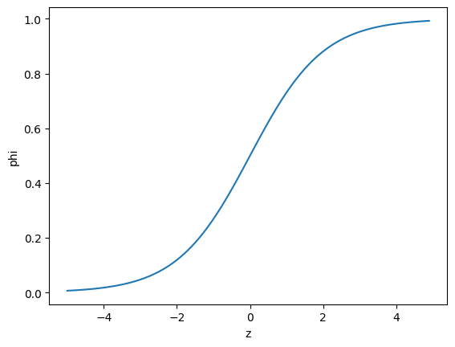

# 04-1. 로지스틱 회귀

물고기의 무게·길이·대각선 길이·높이·두께를 이용해 물고기 종류를 분류하고, **K-최근접 이웃의 확률 계산**과 **로지스틱 회귀의 시그모이드·소프트맥스 함수**를 확인한 실습입니다.

- 실습 노트북: [`04_01_logistic_regression.ipynb`](./04_01_logistic_regression.ipynb)
- 입력 특성: `Weight`, `Length`, `Diagonal`, `Height`, `Width`
- 타깃: `Species`
- 모델: `KNeighborsClassifier`, `LogisticRegression`

---

## 전체 흐름

```text
물고기 데이터 준비
→ 훈련·테스트 세트 분리
→ 특성 표준화
→ KNN으로 다중 분류
→ 예측 확률과 이웃 확인
→ 도미·빙어 이진 로지스틱 회귀
→ 시그모이드로 양성 확률 계산
→ 7종 물고기 다중 로지스틱 회귀
→ 소프트맥스로 클래스별 확률 계산
```

## 핵심 결과

| 모델 | 훈련 정확도 | 테스트 정확도 |
|---|---:|---:|
| KNN `n_neighbors=3` | `0.8908` | `0.8500` |
| 로지스틱 회귀 `C=20` | `0.9328` | `0.9250` |

---

## 1. 데이터 준비

```python
import pandas as pd

fish = pd.read_csv("http://bit.ly/fish_csv_data")
fish.head()
```

`pd.read_csv()`는 CSV 데이터를 pandas의 표 형태인 `DataFrame`으로 읽습니다.

```python
print(pd.unique(fish["Species"]))
```

`pd.unique()`는 중복을 제거하고 물고기 종류만 보여 줍니다.

```text
Bream, Roach, Whitefish, Parkki, Perch, Pike, Smelt
```

```python
fish_input = fish[["Weight", "Length", "Diagonal", "Height", "Width"]]
fish_target = fish["Species"]
```

- `fish_input`: 모델이 참고할 수치 특성
- `fish_target`: 모델이 맞혀야 할 물고기 이름

```python
from sklearn.model_selection import train_test_split

train_input, test_input, train_target, test_target = train_test_split(
    fish_input,
    fish_target,
    random_state=42
)
```

전체 데이터를 훈련용과 평가용으로 나눕니다. `random_state=42`는 실행할 때마다 같은 분할 결과를 얻기 위한 값입니다.

---

## 2. 특성 표준화

```python
from sklearn.preprocessing import StandardScaler

ss = StandardScaler()
ss.fit(train_input)

train_scaled = ss.transform(train_input)
test_scaled = ss.transform(test_input)
```

KNN은 샘플 사이의 거리를 사용하므로 숫자 범위가 큰 특성이 지나치게 큰 영향을 주지 않도록 스케일을 맞춰야 합니다.

```text
fit()       → 훈련 세트의 평균과 표준편차 계산
transform() → 계산한 기준으로 실제 데이터 변환
```

테스트 세트에는 다시 `fit()`하지 않고 훈련 세트의 기준을 그대로 적용합니다.

---

## 3. K-최근접 이웃 분류

```python
from sklearn.neighbors import KNeighborsClassifier

kn = KNeighborsClassifier(n_neighbors=3)
kn.fit(train_scaled, train_target)
```

새로운 물고기와 가장 가까운 훈련 샘플 3개를 찾고, 이웃 중 가장 많은 물고기 종류로 예측합니다.

```python
print(kn.score(train_scaled, train_target))
print(kn.score(test_scaled, test_target))
```

```text
훈련 정확도: 0.8908
테스트 정확도: 0.8500
```

### 클래스와 예측 결과

```python
print(kn.classes_)
print(kn.predict(test_scaled[:5]))
```

`classes_`는 모델이 기억하는 클래스 순서입니다. 이 순서는 `predict_proba()`가 반환하는 확률 배열의 열 순서와 같습니다.

```python
proba = kn.predict_proba(test_scaled[:5])
print(np.round(proba, decimals=4))
```

`predict_proba()`는 각 샘플이 각 클래스에 속할 확률을 반환합니다.

KNN의 `n_neighbors=3`에서는 이웃 3개의 비율을 사용하므로 확률이 주로 다음 값으로 나타납니다.

```text
0, 1/3, 2/3, 1
```

### 가까운 이웃 확인

```python
distances, indexes = kn.kneighbors(test_scaled[3:4])
print(train_target[indexes[0]])
```

- `distances`: 선택한 샘플과 이웃 사이의 거리
- `indexes`: 가까운 이웃이 훈련 세트의 몇 번째 샘플인지 나타내는 위치
- `3:4`: 네 번째 샘플 하나를 선택하면서 2차원 형태를 유지

---

## 4. 시그모이드 함수

로지스틱 회귀는 먼저 입력 특성에 계수를 곱해 선형 점수 `z`를 만듭니다.

```text
z = 계수₁×특성₁ + 계수₂×특성₂ + ... + 절편
```

시그모이드 함수는 이 값을 `0~1` 사이로 바꿉니다.

```text
확률 = 1 / (1 + e^(-z))
```



```text
z가 큰 음수 → 확률이 0에 가까움
z = 0       → 확률이 0.5
z가 큰 양수 → 확률이 1에 가까움
```

---

## 5. 불리언 인덱싱으로 도미와 빙어 선택

```python
bream_smelt_indexes = (
    (train_target == "Bream") |
    (train_target == "Smelt")
)

train_bream_smelt = train_scaled[bream_smelt_indexes]
target_bream_smelt = train_target[bream_smelt_indexes]
```

`train_target`에서 도미 또는 빙어인 위치를 `True`로 표시한 뒤, 같은 위치의 입력과 타깃을 함께 선택합니다.

```text
train_scaled → 도미·빙어의 수치 특성만 선택
train_target → 도미·빙어의 이름만 선택
```

입력 한 행과 정답 하나의 대응을 유지하려고 같은 불리언 배열을 양쪽에 적용합니다.

---

## 6. 이진 로지스틱 회귀

```python
from sklearn.linear_model import LogisticRegression

lr = LogisticRegression()
lr.fit(train_bream_smelt, target_bream_smelt)
```

도미와 빙어 두 클래스를 구분하는 모델입니다.

```python
print(lr.classes_)
```

```text
['Bream', 'Smelt']
```

- 첫 번째 클래스 `Bream`: 음성 클래스
- 두 번째 클래스 `Smelt`: 양성 클래스

```python
print(lr.predict_proba(train_bream_smelt[:5]))
```

각 행은 다음 구조입니다.

```text
[Bream 확률, Smelt 확률]
```

두 확률의 합은 항상 1입니다.

### 계수와 z값

```python
print(lr.coef_, lr.intercept_)
```

- `coef_`: 각 특성에 곱하는 계수
- `intercept_`: 절편

```python
decisions = lr.decision_function(train_bream_smelt[:5])
```

`decision_function()`은 샘플마다 양성 클래스인 `Smelt` 쪽으로 얼마나 기울었는지 나타내는 선형 점수 `z`를 반환합니다.

```python
from scipy.special import expit

print(expit(decisions))
```

`expit()`은 시그모이드 함수이며, `z`를 양성 클래스 확률로 변환합니다.

```text
expit(decision_function())
= predict_proba()의 두 번째 열
```

음성 클래스 확률은 `1 - 양성 클래스 확률`로 계산할 수 있습니다.

---

## 7. 다중 로지스틱 회귀

```python
lr = LogisticRegression(C=20, max_iter=1000)
lr.fit(train_scaled, train_target)
```

7종 물고기를 한 번에 분류합니다.

- `C`: 규제 강도의 역수
- 작은 `C`: 규제가 강함
- 큰 `C`: 규제가 약함
- `max_iter=1000`: 최대 학습 반복 횟수

```python
print(lr.score(train_scaled, train_target))
print(lr.score(test_scaled, test_target))
```

```text
훈련 정확도: 0.9328
테스트 정확도: 0.9250
```

```python
print(lr.coef_.shape, lr.intercept_.shape)
```

```text
coef_:      (7, 5)
intercept_: (7,)
```

7개 클래스마다 특성 5개의 계수와 절편 하나를 학습합니다.

---

## 8. 소프트맥스 함수

```python
decision = lr.decision_function(test_scaled[:5])
```

다중 분류에서는 샘플마다 7개 클래스의 선형 점수를 계산합니다.

```python
from scipy.special import softmax

proba = softmax(decision, axis=1)
```

`softmax()`는 한 샘플의 클래스별 점수를 확률로 바꿉니다.

```text
각 확률은 0~1 사이
한 행의 확률 합은 1
가장 높은 확률의 클래스가 최종 예측
```

이 결과는 `lr.predict_proba()`가 반환한 확률과 같습니다.

---

## 핵심 메서드

| 명령 | 역할 |
|---|---|
| `fit(X, y)` | 입력과 정답으로 모델 학습 |
| `predict(X)` | 최종 클래스 예측 |
| `predict_proba(X)` | 클래스별 확률 반환 |
| `score(X, y)` | 분류 정확도 계산 |
| `kneighbors(X)` | 가까운 이웃의 거리와 위치 반환 |
| `decision_function(X)` | 확률 변환 전 선형 점수 반환 |
| `classes_` | 클래스와 확률 열의 순서 |
| `coef_` | 학습된 특성별 계수 |
| `intercept_` | 학습된 절편 |

---

## 정리

```text
KNN
→ 가까운 이웃의 클래스 비율로 확률 계산

이진 로지스틱 회귀
→ z를 시그모이드에 넣어 양성 클래스 확률 계산

다중 로지스틱 회귀
→ 클래스별 z를 소프트맥스에 넣어 전체 확률 계산
```
