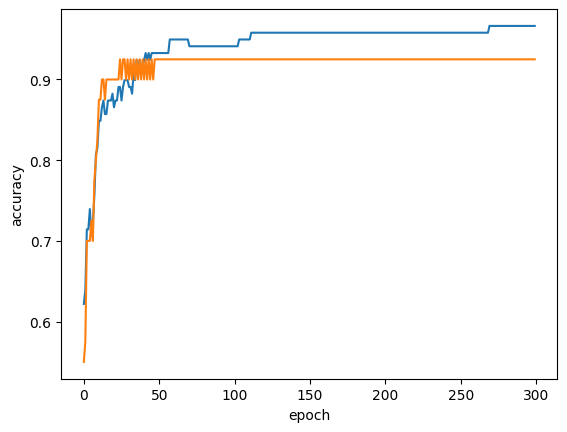

# 04-2. 확률적 경사 하강법

생선의 무게·길이·대각선 길이·높이·두께를 이용해 7개 어종을 분류하고, `SGDClassifier`의 점진적 학습과 에포크별 정확도 변화를 확인한 실습입니다.

- 실습 노트북: [`04_02_stochastic_gradient_descent.ipynb`](04_02_stochastic_gradient_descent.ipynb)
- 입력 특성: `Weight`, `Length`, `Diagonal`, `Height`, `Width`
- 타깃: `Species`
- 모델: `SGDClassifier`
- 비교 손실: `log_loss`, `hinge`

---

## 전체 흐름

```text
물고기 데이터 준비
→ 훈련·테스트 세트 분리
→ 특성 표준화
→ SGDClassifier로 10에포크 학습
→ partial_fit으로 추가 학습
→ 300에포크 정확도 기록
→ 학습 곡선 해석
→ 100에포크로 최종 학습
→ log_loss와 hinge 비교
```

## 핵심 결과

| 실험 | 훈련 정확도 | 테스트 정확도 |
|---|---:|---:|
| `log_loss`, `max_iter=10` | `0.7731` | `0.7750` |
| `partial_fit()` 1회 추가 | `0.7983` | `0.7750` |
| `log_loss`, 100에포크 | `0.9580` | `0.9250` |
| `hinge`, 100에포크 | `0.9496` | `0.9250` |

---

## 1. 지도 학습 분류 문제

```python
fish_input = fish[['Weight', 'Length', 'Diagonal', 'Height', 'Width']]
fish_target = fish['Species']
```

입력 특성으로 어종 이름을 예측하므로 다중 분류 문제입니다. `fish_target`이라는 정답이 있으므로 지도 학습입니다.

> **이전 질문과 연결 — “회귀는 지도 학습이고 분류는 비지도 학습인가?”**  
> 회귀와 분류는 모두 정답이 있으면 지도 학습입니다. 비지도 학습은 타깃 없이 데이터의 구조를 찾습니다.

---

## 2. 데이터 분리와 표준화

```python
train_input, test_input, train_target, test_target = train_test_split(
    fish_input,
    fish_target,
    random_state=42
)

ss = StandardScaler()
ss.fit(train_input)
train_scaled = ss.transform(train_input)
test_scaled = ss.transform(test_input)
```

`StandardScaler`는 훈련 세트의 평균과 표준편차를 구한 뒤 각 특성의 범위를 맞춥니다. 테스트 세트에는 훈련 세트에서 구한 기준만 적용합니다.

> **이전 질문과 연결 — “표준화하면 값이 왜 변하고, 결정 트리는 왜 필요 없나?”**  
> 표준화는 같은 샘플을 다른 단위로 표현하는 과정입니다. 경사 하강법은 특성값의 크기에 따라 기울기와 계수 갱신 폭이 달라지므로 표준화가 중요합니다. 결정 트리는 값의 거리보다 정렬 순서와 분할 기준을 사용하므로 스케일 변화의 영향을 거의 받지 않습니다.

---

## 3. 확률적 경사 하강법

확률적 경사 하강법은 훈련 샘플을 사용해 손실이 감소하는 방향으로 계수를 조금씩 수정합니다.

| 방식 | 한 번의 계수 갱신에 사용하는 데이터 |
|---|---|
| 확률적 경사 하강법 | 샘플 1개 |
| 미니배치 경사 하강법 | 일부 샘플 |
| 배치 경사 하강법 | 전체 샘플 |

`SGDClassifier`는 선형 분류 모델을 확률적 경사 하강법으로 학습합니다.

```python
sc = SGDClassifier(loss='log_loss', max_iter=10, random_state=42)
sc.fit(train_scaled, train_target)
```

`max_iter=10`에서 수렴 경고가 발생했습니다. 정해 둔 반복 횟수 안에 최적화가 충분히 끝나지 않았다는 뜻이며 코드 오류는 아닙니다.

---

## 4. `fit()`과 `partial_fit()`

```python
sc.partial_fit(train_scaled, train_target)
```

- `fit()`: 모델을 새로 학습
- `partial_fit()`: 현재 계수를 유지한 채 추가 학습

이 실습에서는 전체 훈련 세트를 `partial_fit()`에 전달하므로 한 번 호출할 때 훈련 세트를 한 번 학습합니다. 새 데이터가 계속 들어오는 상황에서는 일부 샘플만 전달해 점진적으로 갱신할 수 있습니다.

첫 `partial_fit()` 호출에는 가능한 전체 클래스 목록이 필요합니다.

```python
classes = np.unique(train_target)
sc.partial_fit(train_scaled, train_target, classes=classes)
```

---

## 5. 에포크별 정확도

```python
for epoch in range(300):
    sc.partial_fit(train_scaled, train_target, classes=classes)
    train_score.append(sc.score(train_scaled, train_target))
    test_score.append(sc.score(test_scaled, test_target))
```



- 파란색: 훈련 정확도
- 주황색: 테스트 정확도

초반에는 두 정확도가 함께 상승합니다. 약 50~100에포크 이후 테스트 정확도는 거의 `0.925`에 머무르지만 훈련 정확도는 계속 조금씩 상승합니다. 이 구간부터는 더 오래 학습해도 일반화 성능이 개선되지 않습니다.

> **이전 질문과 연결 — “훈련 0.96, 테스트 0.99면 테스트가 높으니 수정할 필요 없는가?”**  
> 테스트 점수가 조금 높다는 이유만으로 과소적합이라고 단정하지 않습니다. 분할된 샘플의 난이도 차이 때문에 테스트 점수가 더 높을 수 있습니다. 둘 다 낮으면 과소적합, 훈련만 계속 높아지고 테스트가 정체되면 과대적합으로 판단합니다.

---

## 6. 100에포크로 최종 학습

```python
sc = SGDClassifier(
    loss='log_loss',
    max_iter=100,
    tol=None,
    random_state=42
)
sc.fit(train_scaled, train_target)
```

`tol=None`은 조기 종료를 끄고 지정한 100에포크를 모두 실행하게 합니다.

```text
훈련 정확도: 0.9580
테스트 정확도: 0.9250
```

10에포크 모델보다 테스트 정확도가 크게 개선됐습니다.

---

## 7. 손실 함수 비교

```python
SGDClassifier(loss='log_loss', ...)
SGDClassifier(loss='hinge', ...)
```

- `log_loss`: 로지스틱 회귀 손실. 클래스 확률을 다루는 분류에 적합
- `hinge`: 선형 SVM 손실. 결정 경계와 클래스 사이의 여유를 확보하도록 학습

두 모델의 테스트 정확도는 모두 `0.9250`이었습니다. 정확도가 같다면 확률 출력이 필요한지, 결정 경계 중심의 분류가 필요한지를 기준으로 선택합니다.

---

## 핵심 메서드와 매개변수

| 항목 | 역할 |
|---|---|
| `fit(X, y)` | 모델을 처음부터 학습 |
| `partial_fit(X, y)` | 기존 계수를 유지하며 추가 학습 |
| `score(X, y)` | 분류 정확도 계산 |
| `loss='log_loss'` | 로지스틱 회귀 손실 사용 |
| `loss='hinge'` | 선형 SVM 손실 사용 |
| `max_iter` | 훈련 세트 반복 횟수의 상한 |
| `tol=None` | 자동 조기 종료를 끔 |
| `classes` | 첫 점진 학습 때 전체 클래스 목록 전달 |

---

## 정리

```text
확률적 경사 하강법
→ 손실을 줄이는 방향으로 계수를 반복 갱신

partial_fit
→ 이전 학습 상태를 유지하며 추가 학습

에포크 곡선
→ 훈련 정확도와 테스트 정확도를 함께 보고 학습 중단 시점 판단
```

핵심은 에포크를 무조건 늘리는 것이 아니라, 테스트 성능이 더 이상 좋아지지 않는 시점을 확인하는 것입니다.
