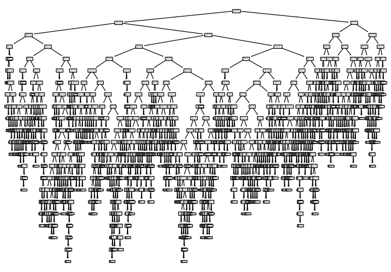
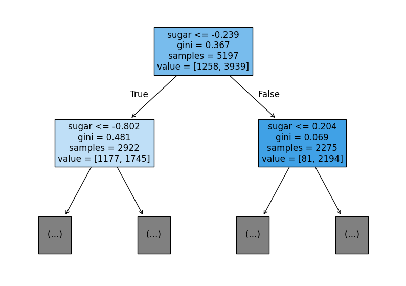
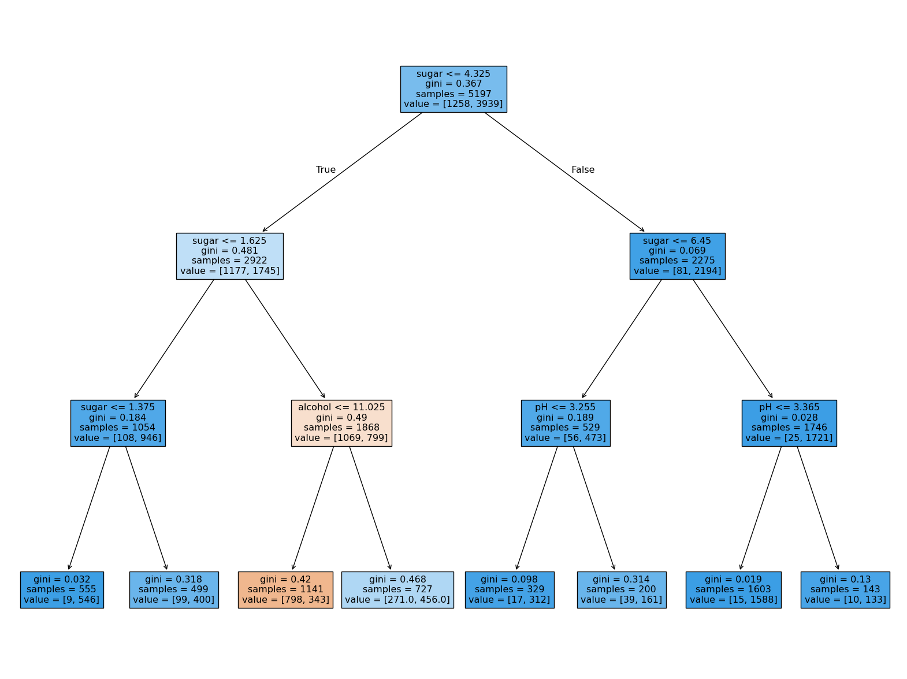
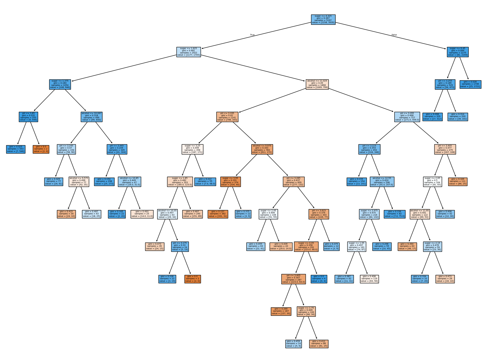

# 05-1. 결정 트리

와인의 `alcohol`, `sugar`, `pH`를 이용해 `class`를 분류하고, 로지스틱 회귀와 결정 트리를 비교하면서 노드·지니 불순도·정보 이득·가지치기·특성 중요도를 확인한 실습입니다.

- 실습 노트북: [`05_01_decision_tree.ipynb`](05_01_decision_tree.ipynb)
- 입력 특성: `alcohol`, `sugar`, `pH`
- 타깃: `class`
- 모델: `LogisticRegression`, `DecisionTreeClassifier`
- 복잡도 제한: `max_depth`, `min_impurity_decrease`

---

## 전체 흐름

```text
와인 데이터 확인
→ 훈련·테스트 세트 분리
→ 로지스틱 회귀 기준 성능 확인
→ 제한 없는 결정 트리 학습
→ 트리 노드와 불순도 해석
→ max_depth=3으로 깊이 제한
→ 원본 데이터로 표준화 불필요 확인
→ 특성 중요도 확인
→ min_impurity_decrease로 분할 제한
```

## 핵심 결과

| 모델 | 훈련 정확도 | 테스트 정확도 |
|---|---:|---:|
| 로지스틱 회귀 | `0.7808` | `0.7777` |
| 제한 없는 결정 트리 | `0.9969` | `0.8592` |
| 결정 트리 `max_depth=3` | `0.8455` | `0.8415` |
| 원본 데이터, `max_depth=3` | `0.8455` | `0.8415` |
| 결정 트리 `min_impurity_decrease=0.0005` | `0.8874` | `0.8615` |

---

## 1. 데이터 준비

```python
wine = pd.read_csv('https://bit.ly/wine_csv_data')
wine.info()
wine.describe()
```

데이터는 6497행이며 `alcohol`, `sugar`, `pH`, `class` 네 열에 결측값이 없습니다.

```python
data = wine[['alcohol', 'sugar', 'pH']]
target = wine['class']

train_input, test_input, train_target, test_target = train_test_split(
    data,
    target,
    test_size=0.2,
    random_state=42
)
```

- 훈련 세트: `(5197, 3)`
- 테스트 세트: `(1300, 3)`

---

## 2. 로지스틱 회귀 기준 모델

```python
ss = StandardScaler()
ss.fit(train_input, train_target)

train_scaled = ss.transform(train_input)
test_scaled = ss.transform(test_input)

lr = LogisticRegression()
lr.fit(train_scaled, train_target)
```

`StandardScaler`는 타깃을 사용하지 않으므로 `fit(train_input)`만 써도 같습니다. 원본 실습에서는 두 번째 인수를 전달했지만 내부적으로 무시됩니다.

```text
훈련 정확도: 0.7808
테스트 정확도: 0.7777
```

두 점수 차이는 작지만 정확도는 약 `0.78`에 머뭅니다.

---

## 3. 제한 없는 결정 트리

```python
dt = DecisionTreeClassifier(random_state=42)
dt.fit(train_scaled, train_target)
```

```text
훈련 정확도: 0.9969
테스트 정확도: 0.8592
```

훈련 데이터를 거의 모두 맞혔지만 테스트 점수와 차이가 큽니다. 트리가 제한 없이 깊어지면서 훈련 데이터의 세부 규칙까지 외운 과대적합 상태입니다.

> **이전 질문과 연결 — 훈련 점수와 테스트 점수는 어떻게 봐야 하나?**  
> 테스트 점수가 훈련 점수보다 조금 높은 경우는 샘플 난이도 차이일 수 있습니다. 하지만 여기처럼 훈련 `0.9969`, 테스트 `0.8592`로 차이가 크면 과대적합으로 봅니다.



전체 트리는 너무 깊어서 개별 규칙보다 복잡도를 확인하는 용도입니다.

---

## 4. 결정 트리 노드 읽기



루트 노드는 다음 정보를 담습니다.

```text
sugar <= -0.239     분할 조건
gini = 0.367        클래스가 섞인 정도
samples = 5197      노드의 샘플 수
value = [1258,3939] 클래스별 샘플 수
```

- 조건이 참이면 왼쪽, 거짓이면 오른쪽으로 이동합니다.
- `gini=0`이면 한 클래스만 있는 순수한 노드입니다.
- `value`에서 더 많은 클래스가 이 노드의 예측 클래스입니다.
- 색이 진할수록 한 클래스의 비율이 높습니다.

> **이전 질문과 연결 — “결정 트리의 불순도가 무엇인가?”**  
> 불순도는 한 노드에 서로 다른 클래스가 얼마나 섞였는지를 나타냅니다. 한 종류만 있으면 `0`, 두 종류가 비슷하게 섞일수록 커집니다.

이진 분류의 지니 불순도는 다음과 같습니다.

```text
지니 불순도 = 1 - (클래스 0 비율² + 클래스 1 비율²)
```

루트의 `value=[1258,3939]`를 넣으면 약 `0.367`입니다.

### 부모와 자식의 불순도 차이

루트 분할의 감소량을 그림에 표시된 값으로 계산하면 다음과 같습니다.

```text
0.367
- [(2922/5197)×0.481 + (2275/5197)×0.069]
≈ 0.066
```

> **이전 질문과 연결 — “왜 부모 노드와 자식 노드의 불순도 차이를 크게 하나?”**  
> 차이가 클수록 분할 뒤 클래스가 더 잘 구분됐다는 뜻입니다. 결정 트리는 가능한 조건 중 이 감소량이 가장 큰 조건을 선택합니다.

> **이전 질문과 연결 — “불순도 차이와 정보 이득은 같은 말인가?”**  
> 이 실습에서는 부모 불순도에서 자식들의 가중 평균 불순도를 뺀 감소량을 정보 이득으로 이해하면 됩니다. 넓게는 불순도 감소량과 같은 뜻으로 쓰이고, 엄밀하게는 엔트로피 감소를 정보 이득이라고 부르는 경우도 있습니다.

---

## 5. `max_depth=3`으로 깊이 제한

```python
dt = DecisionTreeClassifier(max_depth=3, random_state=42)
dt.fit(train_scaled, train_target)
```

```text
훈련 정확도: 0.8455
테스트 정확도: 0.8415
```

깊이를 제한하자 훈련·테스트 점수 차이는 줄었지만 전체 정확도도 낮아졌습니다.


---

## 6. 결정 트리에 표준화가 필요하지 않은 이유

```python
dt = DecisionTreeClassifier(max_depth=3, random_state=42)
dt.fit(train_input, train_target)
```

원본 데이터로 학습해도 점수는 같습니다.

```text
훈련 정확도: 0.8455
테스트 정확도: 0.8415
```

> **이전 질문과 연결 — “표준화하면 값은 변하는데 결정 트리는 왜 전처리가 필요 없나?”**  
> 표준화는 숫자의 단위를 바꾸지만 값의 순서는 유지합니다. 결정 트리는 거리나 기울기가 아니라 임계값보다 작은지 큰지를 기준으로 분할하므로 같은 샘플들이 좌우로 나뉩니다.

표준화된 트리의 `sugar <= -0.239`와 원본 단위 트리의 `sugar <= 4.325`는 같은 분할입니다. 원본 단위가 규칙을 해석하기 더 쉽습니다.



---

## 7. 특성 중요도

```python
print(dt.feature_importances_)
```

```text
[0.12345626, 0.86862934, 0.0079144]
```

| 특성 | 중요도 |
|---|---:|
| `alcohol` | `0.1235` |
| `sugar` | `0.8686` |
| `pH` | `0.0079` |

이 트리에서는 `sugar`가 전체 불순도 감소에 가장 크게 기여했습니다. 세 값의 합은 1입니다.

---

## 8. `min_impurity_decrease`로 분할 제한

```python
dt = DecisionTreeClassifier(
    min_impurity_decrease=0.0005,
    random_state=42
)
dt.fit(train_input, train_target)
```

불순도 감소량이 충분하지 않은 분할은 만들지 않습니다.

```text
훈련 정확도: 0.8874
테스트 정확도: 0.8615
```

제한 없는 트리보다 훈련 점수는 낮아졌고 테스트 점수는 `0.8592`에서 `0.8615`로 조금 높아졌습니다. 의미가 작은 가지를 제거해 과대적합을 완화한 결과입니다.



---

## 핵심 항목

| 항목 | 역할 |
|---|---|
| `DecisionTreeClassifier()` | 분류 결정 트리 생성 |
| `plot_tree()` | 학습한 트리 시각화 |
| `max_depth` | 트리의 최대 깊이 제한 |
| `min_impurity_decrease` | 최소 불순도 감소량보다 작은 분할 제거 |
| `feature_importances_` | 특성별 불순도 감소 기여도 |
| `gini` | 노드 안 클래스의 혼합 정도 |
| `samples` | 노드에 도달한 샘플 수 |
| `value` | 클래스별 샘플 수 |

---

## 정리

```text
결정 트리
→ 조건이 참이면 왼쪽, 거짓이면 오른쪽으로 이동

불순도 감소
→ 자식 노드가 부모보다 얼마나 더 순수해졌는지 측정

가지치기
→ max_depth와 min_impurity_decrease로 복잡도 제한

표준화
→ 결정 트리의 분할 구조와 정확도에는 거의 영향을 주지 않음
```

핵심은 결정 트리가 **부모보다 더 순수한 자식 노드를 만드는 질문을 반복해서 선택한다는 것**입니다.
