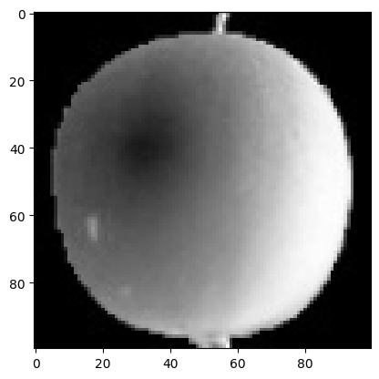
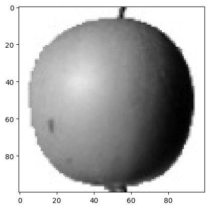
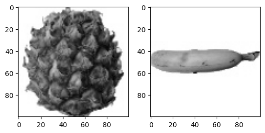
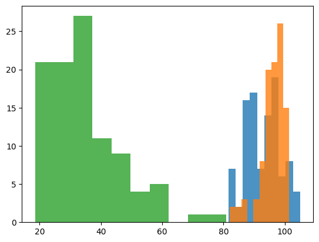
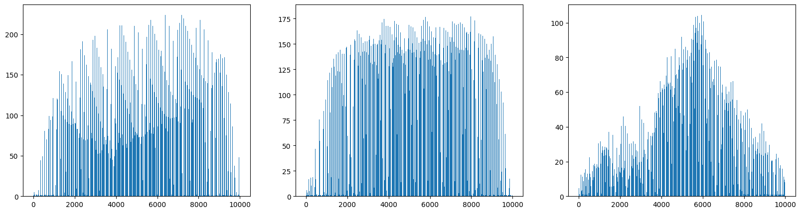
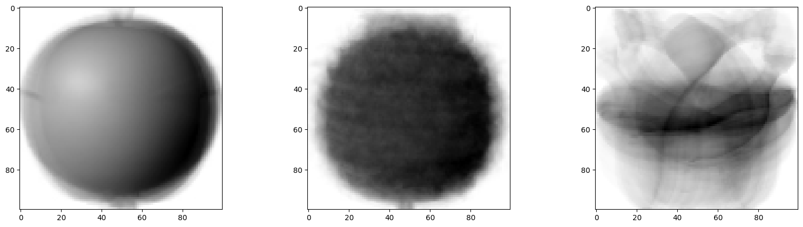
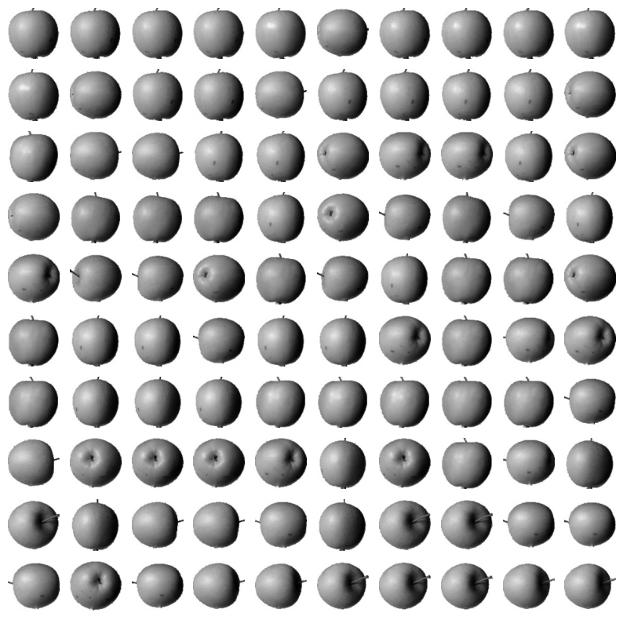

# 06-1. 군집 알고리즘

과일 이미지의 픽셀값을 분석해 정답 레이블 없이 비슷한 이미지를 모으는 과정을 확인한 실습입니다.

- 실습 노트북: [`06_01_clustering_algorithm.ipynb`](06_01_clustering_algorithm.ipynb)
- 데이터 크기: `(300, 100, 100)`
- 과일 종류: 사과·파인애플·바나나 각 100장
- 이미지 크기: `100×100`
- 이미지 한 장의 특성 수: `10000`

---

## 전체 흐름

```text
과일 이미지 데이터 불러오기
→ 배열과 픽셀값 확인
→ 과일별 이미지 배열 분리
→ 이미지별 평균 밝기 비교
→ 위치별 평균 픽셀 계산
→ 과일별 평균 이미지 생성
→ 평균 사과 이미지와의 차이 계산
→ 가장 비슷한 이미지 100장 선택
```

---

## 1. 이미지 배열의 구조

```python
fruits = np.load('fruits_300.npy')
print(fruits.shape)
```

```text
(300, 100, 100)
```

```text
300개의 이미지
└─ 이미지마다 100행
   └─ 행마다 100개의 픽셀
```

이미지 한 장이 하나의 샘플이고, 픽셀값 하나가 하나의 특성입니다.

> **이전 질문과 연결 — “머신러닝에서 차원이 무엇인가?”**  
> 이미지 한 장을 펼치면 `100×100=10000`개의 숫자가 됩니다. 따라서 샘플 하나가 10000개의 특성, 즉 10000차원으로 표현됩니다. 여기서 차원은 화면의 공간 차원이 아니라 모델에 입력되는 특성의 개수입니다.

---

## 2. 픽셀값과 이미지 표시

```python
print(fruits[0, 0, :])
```

`fruits[0, 0, :]`은 첫 번째 이미지의 첫 번째 행에 있는 픽셀값 100개입니다. 각 숫자는 해당 위치의 밝기를 나타냅니다.

```python
plt.imshow(fruits[0], cmap='gray')
plt.show()
```



`gray_r`은 화면에 표시되는 밝기만 반대로 바꿉니다. 원본 픽셀값은 변하지 않습니다.





---

## 3. 이미지를 10000개 특성으로 펼치기

```python
apple = fruits[0:100].reshape(-1, 100 * 100)
pineapple = fruits[100:200].reshape(-1, 100 * 100)
banana = fruits[200:300].reshape(-1, 100 * 100)
```

```text
원래 이미지 한 장: (100, 100)
펼친 이미지 한 장: (10000,)
과일별 전체 배열: (100, 10000)
```

`reshape()`는 배열의 모양만 바꾸며 픽셀값의 개수와 순서는 유지합니다.

---

## 4. `axis=1`: 이미지별 평균 밝기

```python
apple.mean(axis=1)
```

`apple`의 크기는 `(100, 10000)`입니다. `axis=1`은 각 행에 있는 픽셀 10000개를 평균냅니다.

```text
이미지 1의 픽셀 10000개 → 평균값 1개
이미지 2의 픽셀 10000개 → 평균값 1개
...
이미지 100의 픽셀 10000개 → 평균값 1개
```

결과의 크기는 `(100,)`입니다.

> **이전 질문과 연결 — “샘플의 평균값이 무엇인가?”**  
> 샘플 하나가 이미지 한 장이므로, 샘플 평균은 한 이미지의 모든 픽셀 밝기를 평균낸 값입니다. 이미지의 전체 밝기는 남지만 픽셀 위치와 과일 모양 정보는 사라집니다.

```python
plt.hist(apple.mean(axis=1), alpha=0.8, label='apple')
plt.hist(pineapple.mean(axis=1), alpha=0.8, label='pineapple')
plt.hist(banana.mean(axis=1), alpha=0.8, label='banana')
```



평균 밝기만으로 일부 과일을 구별할 수 있지만 분포가 겹치는 구간도 있습니다.

---

## 5. `axis=0`: 위치별 평균 픽셀

```python
apple.mean(axis=0)
```

`axis=0`은 이미지 100장에 있는 같은 위치의 픽셀끼리 평균냅니다.

```text
이미지 100장의 첫 번째 픽셀 → 첫 번째 평균 픽셀
이미지 100장의 두 번째 픽셀 → 두 번째 평균 픽셀
...
이미지 100장의 10000번째 픽셀 → 10000번째 평균 픽셀
```

결과의 크기는 `(10000,)`입니다.

> **이전 질문과 연결 — “픽셀별 평균값이 무엇인가?”**  
> 같은 위치의 픽셀을 이미지 100장에 걸쳐 평균낸 값입니다. 픽셀의 위치 정보가 유지되므로 다시 `100×100`으로 바꾸면 과일의 평균적인 형태를 볼 수 있습니다.



```python
apple_mean = apple.mean(axis=0).reshape(100, 100)
```



### 두 평균의 차이

| 계산 | 코드 | 결과 크기 | 남는 정보 |
|---|---|---:|---|
| 이미지별 평균 | `mean(axis=1)` | `(100,)` | 이미지마다 전체 평균 밝기 |
| 위치별 평균 | `mean(axis=0)` | `(10000,)` | 과일 종류의 평균적인 형태 |

---

## 6. 평균 사과 이미지와의 차이

```python
abs_diff = np.abs(fruits - apple_mean)
abs_mean = np.mean(abs_diff, axis=(1, 2))
```

```text
픽셀 차이 = |원본 이미지 픽셀 - 평균 사과 픽셀|
```

`axis=(1, 2)`는 각 이미지의 세로와 가로 픽셀 차이를 모두 평균냅니다. 결과는 이미지 300장마다 평균 차이 하나씩인 `(300,)` 배열입니다.

```python
apple_index = np.argsort(abs_mean)[:100]
```

`np.argsort()`로 평균 차이가 작은 순서의 인덱스를 얻고, 앞의 100개를 선택합니다.



평균 사과 이미지와 픽셀 차이가 작은 이미지들이 대부분 사과 형태로 모였습니다.

---

## 7. 분류와 군집

> **이전 질문과 연결 — “분류 문제는 비지도 학습에 용이한가?”**  
> 분류는 정답 클래스를 주고 학습하는 지도 학습입니다. 군집은 정답 없이 비슷한 샘플끼리 묶는 비지도 학습입니다.

이번 실습은 데이터가 과일별 순서로 저장됐다는 사실을 결과 확인에 사용하지만, 이미지를 고르는 계산 자체는 클래스 정답을 학습하지 않습니다. 평균 이미지와의 픽셀 차이라는 유사도만 이용합니다.

---

## 핵심 항목

| 항목 | 의미 |
|---|---|
| 샘플 | 과일 이미지 한 장 |
| 특성 | 이미지의 각 픽셀값 |
| 차원 | 샘플을 표현하는 특성 수 |
| `reshape(-1, 10000)` | 이미지 한 장을 특성 10000개로 펼침 |
| `mean(axis=1)` | 이미지마다 픽셀 전체 평균 계산 |
| `mean(axis=0)` | 같은 위치의 픽셀을 여러 이미지에서 평균 |
| `np.abs()` | 픽셀 차이를 양수 크기로 변환 |
| `mean(axis=(1, 2))` | 이미지마다 전체 픽셀 차이 평균 |
| `np.argsort()` | 차이가 작은 순서의 인덱스 반환 |

---

## 정리

```text
axis=1
→ 한 이미지 안의 픽셀 10000개를 평균
→ 이미지마다 평균 밝기 하나

axis=0
→ 이미지 100장의 같은 위치 픽셀을 평균
→ 과일의 평균적인 이미지 생성

평균 이미지와의 차이
→ 차이가 작을수록 평균적인 사과 모양과 비슷함
```

핵심은 `axis`가 **어느 방향을 따라 값을 평균내고 없앨지 정하는 것**입니다.
