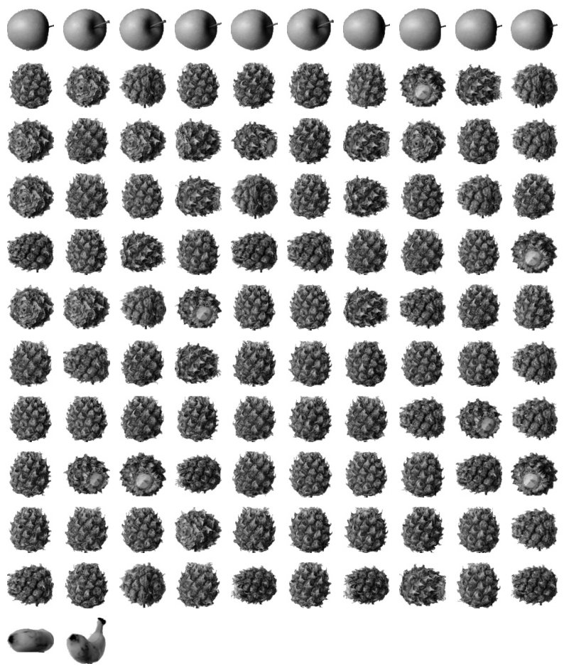
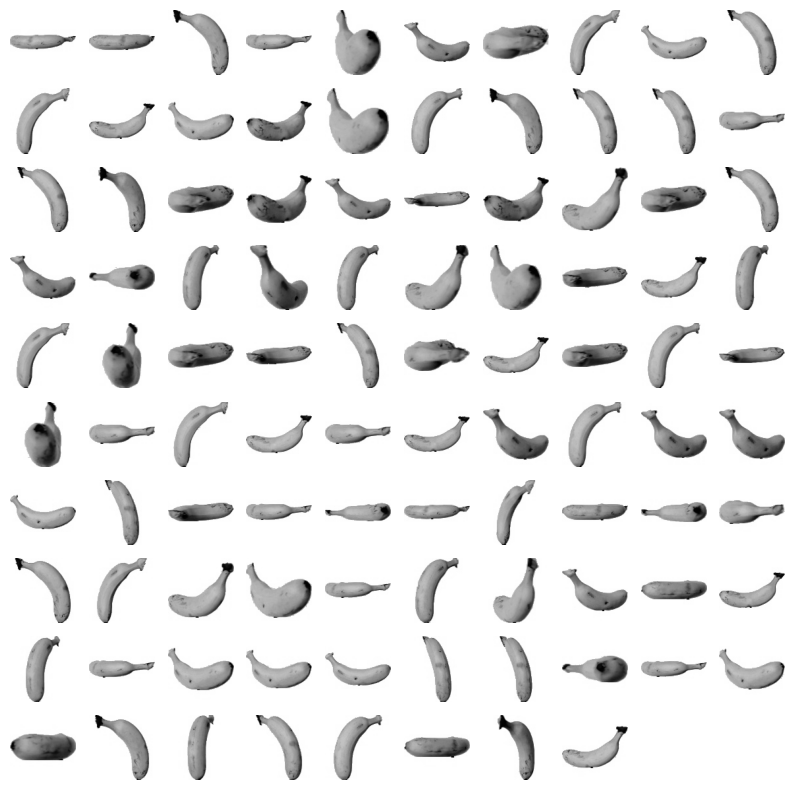
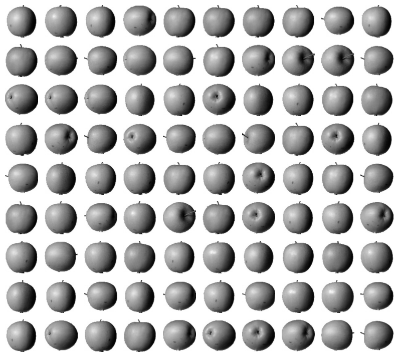
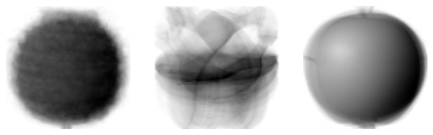
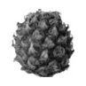
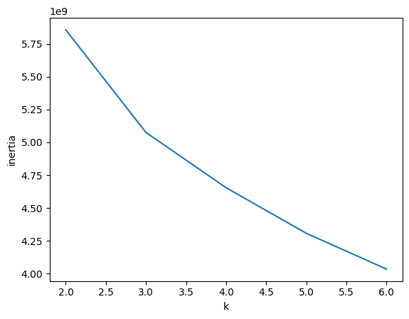

# 06-2. k-평균

과일 이미지 300장을 정답 레이블 없이 세 클러스터로 나누고, 클러스터 중심·거리·이너셔·엘보우 방법을 확인한 실습입니다.

- 실습 노트북: [`06_02_k_means.ipynb`](06_02_k_means.ipynb)
- 데이터 크기: `(300, 100, 100)`
- k-평균 입력 크기: `(300, 10000)`
- 모델: `KMeans`
- 초기 클러스터 수: `3`

---

## 전체 흐름

```text
과일 이미지 불러오기
→ 이미지 한 장을 10000개 픽셀 특성으로 펼치기
→ k=3으로 k-평균 학습
→ 클러스터별 이미지 확인
→ 클러스터 중심 이미지 확인
→ 중심까지의 거리와 예측 확인
→ 이너셔와 엘보우 방법으로 k 판단
```

---

## 1. 이미지 데이터 준비

```python
fruits = np.load('fruits_300.npy')
fruits_2d = fruits.reshape(-1, 100 * 100)
```

```text
원본 배열: (300, 100, 100)
k-평균 입력: (300, 10000)
```

이미지 300장이 샘플이고, 이미지 한 장의 픽셀값 10000개가 특성입니다.

> **이전 질문과 연결 — “머신러닝에서 차원이 무엇인가?”**  
> 이미지 한 장이 10000개의 픽셀 특성으로 표현되므로 이 실습의 샘플은 10000차원입니다. k-평균은 이 공간에서 샘플과 클러스터 중심 사이의 거리를 계산합니다.

---

## 2. k-평균의 학습 과정

```python
km = KMeans(n_clusters=3, random_state=42)
km.fit(fruits_2d)
```

```text
1. 클러스터 중심 k개를 정함
2. 각 샘플을 가장 가까운 중심에 배정
3. 같은 클러스터 샘플들의 평균으로 중심 갱신
4. 배정이 더 이상 변하지 않을 때까지 반복
```

이번 실습은 과일 종류가 3개라는 사실을 알고 있으므로 `n_clusters=3`으로 시작합니다.

---

## 3. 클러스터 번호와 이미지 수

```python
print(np.unique(km.labels_, return_counts=True))
```

| 클러스터 번호 | 이미지 수 |
|---:|---:|
| `0` | `112` |
| `1` | `98` |
| `2` | `90` |

클러스터 번호는 모델이 임의로 붙입니다. `0=사과`처럼 번호 자체에 고정된 의미는 없습니다.

데이터가 사과 100장, 파인애플 100장, 바나나 100장 순서로 저장됐다는 사실을 결과 확인에만 사용하면 다음과 같습니다.

| 클러스터 | 주로 모인 과일 | 다른 과일 |
|---:|---|---|
| `0` | 파인애플 100장 | 사과 10장, 바나나 2장 |
| `1` | 바나나 98장 | 없음 |
| `2` | 사과 90장 | 없음 |







> **이전 질문과 연결 — “분류 문제는 비지도 학습에 용이한가?”**  
> 분류는 정답 클래스를 주고 학습하는 지도 학습입니다. k-평균은 정답 없이 비슷한 샘플끼리 묶는 비지도 학습입니다. 결과가 과일 종류와 비슷하게 나뉘어도 모델이 과일 이름을 학습한 것은 아닙니다.

---

## 4. 클러스터 중심

```python
km.cluster_centers_
```

클러스터 중심은 같은 클러스터에 들어간 이미지들의 평균 벡터입니다. 중심 하나의 크기는 `(10000,)`이고, 이를 `100×100`으로 복원하면 평균적인 과일 형태를 볼 수 있습니다.

```python
draw_fruits(
    km.cluster_centers_.reshape(-1, 100, 100),
    ratio=3
)
```



> **이전 질문과 연결 — “픽셀별 평균값이 무엇인가?”**  
> 클러스터 중심은 클러스터 안의 여러 이미지에서 같은 위치의 픽셀끼리 평균낸 값입니다. 따라서 중심 이미지는 해당 클러스터의 평균적인 형태를 나타냅니다.

---

## 5. 중심까지의 거리와 예측

```python
print(km.transform(fruits_2d[100:101]))
```

101번째 이미지가 각 중심에서 떨어진 거리는 다음과 같습니다.

| 중심 | 거리 |
|---:|---:|
| 클러스터 `0` | `3400.24` |
| 클러스터 `1` | `8837.38` |
| 클러스터 `2` | `5279.34` |

가장 가까운 중심은 클러스터 `0`입니다.

```python
print(km.predict(fruits_2d[100:101]))
```

```text
[0]
```



- `transform()`: 각 클러스터 중심까지의 거리 반환
- `predict()`: 가장 가까운 중심의 번호 반환

---

## 6. 반복 횟수

```python
print(km.n_iter_)
```

```text
4
```

초기 중심에서 시작해 이미지 배정과 중심 갱신을 4회 반복한 뒤 수렴했습니다.

---

## 7. 이너셔

이너셔는 각 샘플과 가장 가까운 클러스터 중심 사이의 거리 제곱을 모두 더한 값입니다.

```python
km.inertia_
```

```text
이너셔가 작음
→ 샘플들이 자신의 중심 가까이에 모임
```

클러스터 수를 늘리면 중심이 많아지므로 이너셔는 항상 감소합니다. 따라서 이너셔가 가장 작은 k를 그대로 고르면 클러스터 수가 지나치게 많아집니다.

---

## 8. 엘보우 방법

```python
inertia = []

for k in range(2, 7):
    km = KMeans(
        n_clusters=k,
        n_init='auto',
        random_state=42
    )
    km.fit(fruits_2d)
    inertia.append(km.inertia_)
```



그래프에서는 `k=2→3`에서 이너셔가 크게 감소하고 이후 감소 폭이 완만해집니다. 따라서 이 데이터에서는 `k=3`이 자연스러운 후보입니다.

---

## 9. k-평균과 특성 스케일

> **이전 질문과 연결 — “표준화가 필요한 모델과 필요 없는 모델은 무엇이 다른가?”**  
> k-평균은 유클리드 거리를 사용하므로 값의 범위가 큰 특성이 결과를 더 크게 좌우합니다. 일반 데이터에서는 특성의 스케일을 맞추는 것이 중요합니다.

이번 실습은 모든 특성이 같은 단위와 범위의 픽셀값이므로 별도 표준화를 하지 않았습니다. 값의 대소 관계만 사용하는 결정 트리와는 다릅니다.

---

## 핵심 항목

| 항목 | 의미 |
|---|---|
| `n_clusters` | 만들 클러스터 수 |
| `labels_` | 각 샘플에 배정된 클러스터 번호 |
| `cluster_centers_` | 클러스터별 평균 중심 벡터 |
| `transform()` | 각 중심까지의 거리 |
| `predict()` | 가장 가까운 중심의 번호 |
| `n_iter_` | 중심 갱신 반복 횟수 |
| `inertia_` | 샘플과 최근접 중심 사이 거리 제곱 합 |
| 엘보우 방법 | 이너셔 감소 폭이 완만해지는 k 선택 |

---

## 정리

```text
k-평균
→ 가까운 중심에 샘플 배정
→ 같은 클러스터 샘플들의 평균으로 중심 갱신
→ 배정이 안정될 때까지 반복

클러스터 중심
→ 클러스터 안 샘플들의 특성별 평균

엘보우 방법
→ k 증가에 따른 이너셔 감소 폭이 꺾이는 지점 확인
```

핵심은 k-평균이 **비슷한 샘플을 묶고 그 샘플들의 평균을 새로운 중심으로 삼는 과정을 반복한다는 것**입니다.
