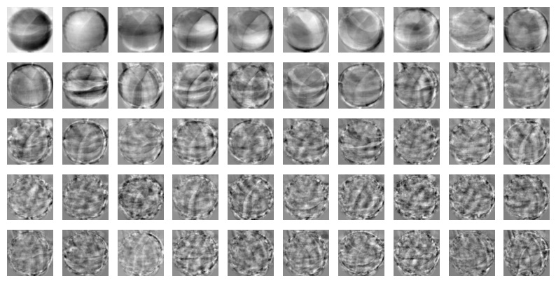
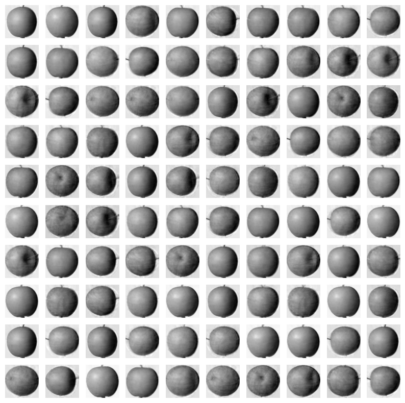
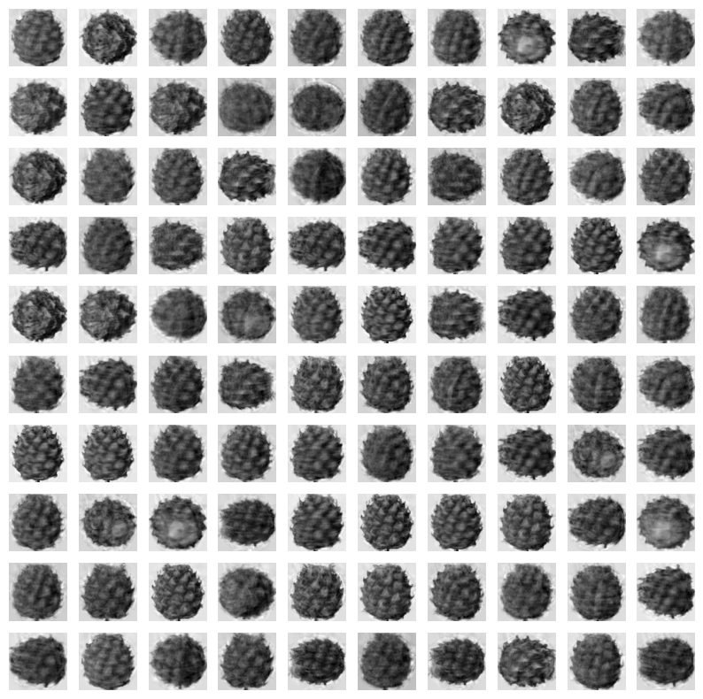
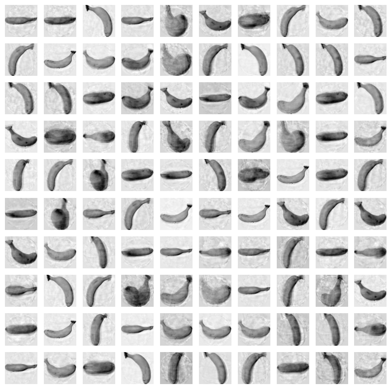
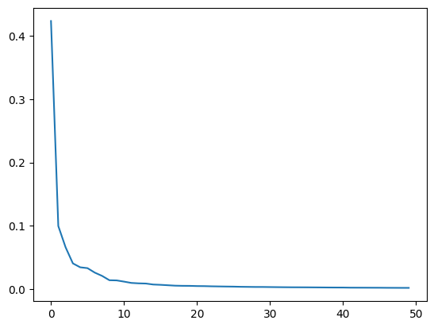
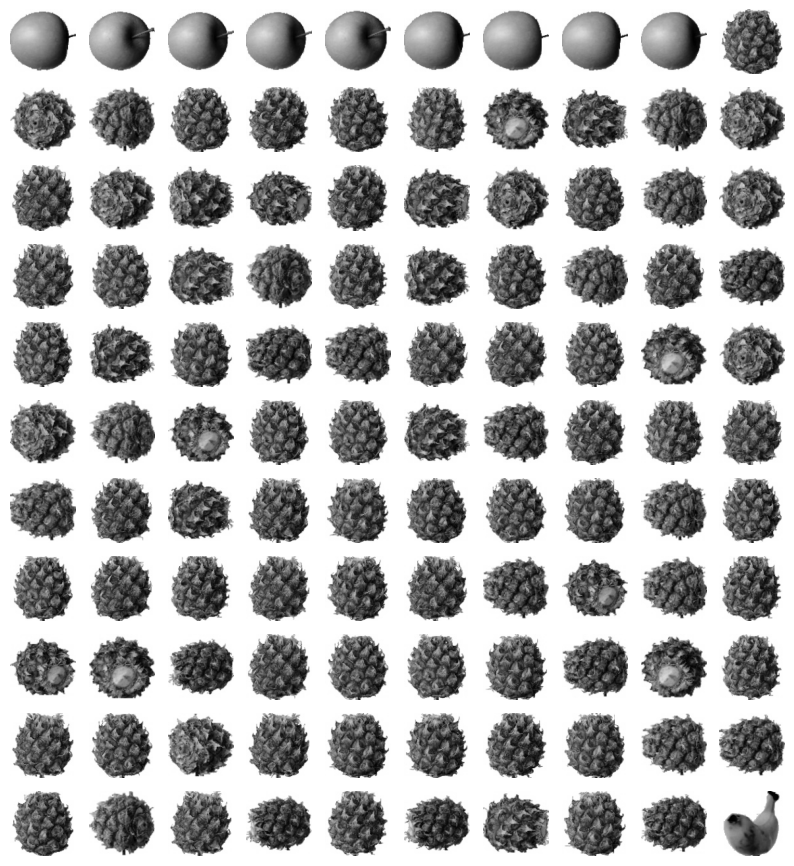
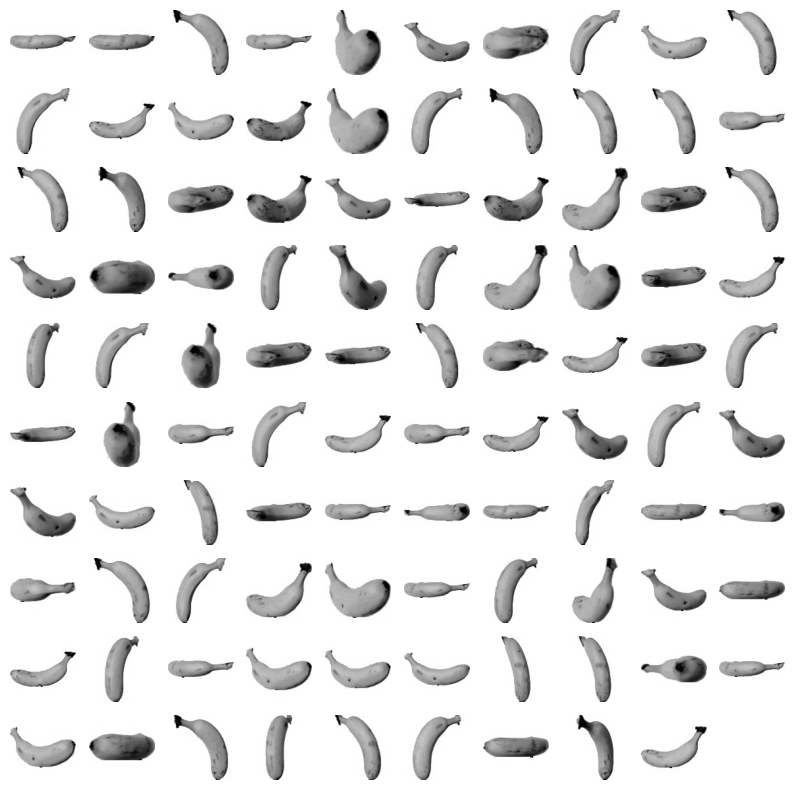
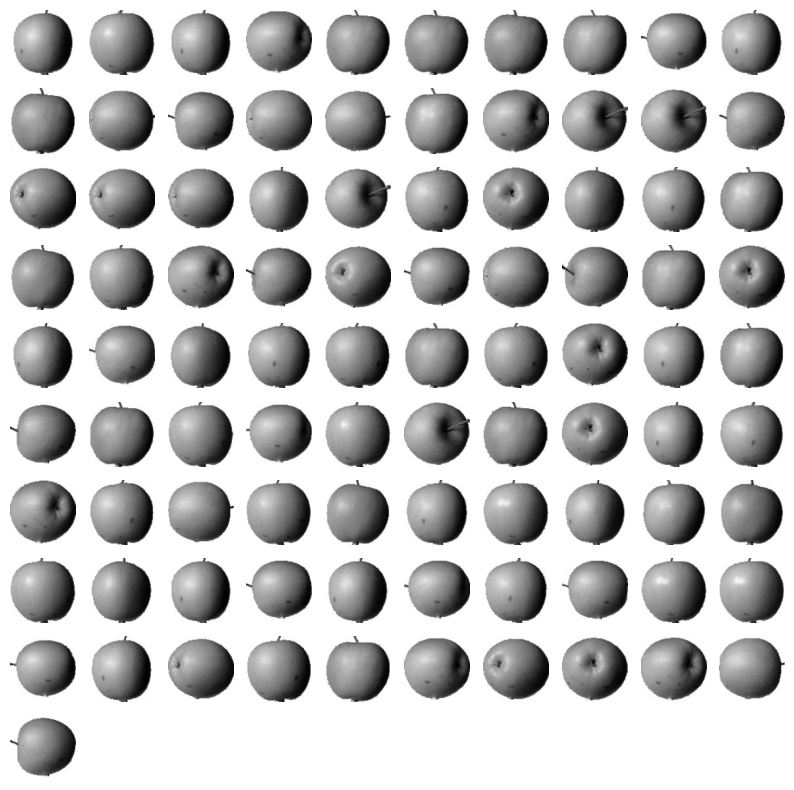
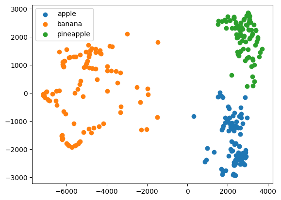
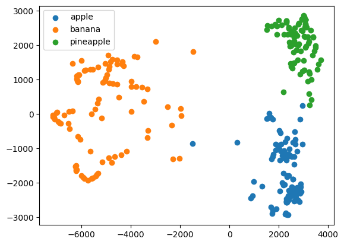

# 06-3. 주성분 분석

과일 이미지의 픽셀 특성 10000개를 더 적은 주성분으로 압축하고, 복원 품질·설명된 분산·분류 시간·군집 결과를 비교한 실습입니다.

- 실습 노트북: [`06_03_principal_component_analysis.ipynb`](06_03_principal_component_analysis.ipynb)
- 원본 데이터 크기: `(300, 10000)`
- 차원 축소 모델: `PCA`
- 분류 모델: `LogisticRegression`
- 군집 모델: `KMeans`

---

## 전체 흐름

```text
과일 이미지 10000차원으로 펼치기
→ 주성분 50개 추출
→ 50차원으로 변환
→ 역변환으로 이미지 복원
→ 설명된 분산 확인
→ PCA 전후 분류 성능 비교
→ 분산 50%와 99% 기준 비교
→ PCA 데이터로 k-평균 군집
```

---

## 1. 차원과 주성분

과일 이미지 한 장은 `100×100=10000`개의 픽셀 특성으로 표현됩니다.

```text
샘플 수: 300
특성 수: 10000
데이터 크기: (300, 10000)
```

> **이전 질문과 연결 — “머신러닝에서 차원이 무엇인가?”**  
> 이 실습에서 차원은 이미지의 공간 차원이 아니라 샘플 하나를 표현하는 특성 수입니다. 픽셀값 10000개를 입력으로 사용하므로 원본 이미지는 10000차원 데이터입니다.

PCA는 샘플들이 가장 넓게 퍼진 방향부터 새로운 축을 찾습니다.

```text
첫 번째 주성분
→ 데이터의 분산이 가장 큰 방향

두 번째 주성분
→ 첫 번째 축과 직각이면서 남은 분산이 가장 큰 방향
```

> **이전 질문과 연결 — “주성분이 무엇이고 분산의 방향이 무엇인가?”**  
> 주성분은 원본 특성들을 조합해 만든 새로운 축입니다. 분산의 방향은 데이터가 그 축을 따라 얼마나 넓게 퍼져 있는지를 뜻합니다. 넓게 퍼진 방향일수록 샘플 차이를 많이 담습니다.

---

## 2. 주성분 50개

```python
pca = PCA(n_components=50)
pca.fit(fruits_2d)
print(pca.components_.shape)
```

```text
(50, 10000)
```

주성분 하나는 원본 픽셀 10000개에 대한 가중치로 구성됩니다.



---

## 3. 주성분에 투영

```python
fruits_pca = pca.transform(fruits_2d)
print(fruits_pca.shape)
```

```text
원본: (300, 10000)
변환: (300, 50)
```

샘플 수 300개는 그대로이고 샘플을 표현하는 특성 수만 10000개에서 50개로 줄었습니다.

> **이전 질문과 연결 — “주성분에 투영해서 특성의 개수를 줄인다는 게 무슨 뜻인가?”**  
> 이미지 한 장을 픽셀값 10000개로 설명하는 대신, 각 주성분을 얼마나 포함하는지 나타내는 좌표 50개로 설명하는 것입니다. 원본 특성을 단순 삭제하는 것이 아니라 새로운 축의 좌표로 바꾸는 과정입니다.

---

## 4. 역변환과 이미지 복원

```python
fruits_inverse = pca.inverse_transform(fruits_pca)
```

주성분 좌표 50개를 다시 픽셀 10000개로 바꿉니다. 사용하지 않은 주성분 정보는 사라졌으므로 원본과 완전히 같지는 않습니다.







세부 정보는 줄었지만 과일의 전체적인 형태는 유지됩니다.

---

## 5. 설명된 분산

```python
print(np.sum(pca.explained_variance_ratio_))
```

```text
0.921606129720387
```

주성분 50개가 원본 데이터 분산의 약 `92.16%`를 보존했습니다.

- `explained_variance_ratio_[i]`: i번째 주성분이 설명하는 분산 비율
- 전체 합: 선택한 주성분들이 보존한 분산 비율



앞쪽 주성분일수록 더 많은 분산을 설명합니다.

> **이전 질문과 연결 — “분산이 큰 방향을 선택하면 왜 차원을 줄일 수 있나?”**  
> 샘플들이 거의 변하지 않는 방향은 샘플을 구분하는 정보가 적습니다. 변화가 큰 방향부터 남기면 적은 축으로도 데이터의 주요 차이를 보존할 수 있습니다.

---

## 6. PCA 전후 분류 성능

| 입력 | 평균 검증 정확도 | 평균 학습 시간 |
|---|---:|---:|
| 원본 10000차원 | `0.9967` | `0.5289초` |
| PCA 50차원 | `0.9967` | `0.0092초` |

이 실행에서는 검증 정확도를 유지하면서 평균 학습 시간이 크게 줄었습니다.

PCA는 정답 타깃을 사용하지 않고 입력 데이터의 분산만 분석하므로 비지도 학습 기반의 차원 축소 방법입니다.

---

## 7. 분산 50% 보존

```python
pca = PCA(n_components=0.5)
pca.fit(fruits_2d)
```

`0.5`는 주성분 50개가 아니라 전체 분산의 50% 이상을 보존하는 최소 주성분 수를 뜻합니다.

```text
주성분 수: 2
변환 데이터: (300, 2)
평균 검증 정확도: 0.99
평균 학습 시간: 0.0220초
```

원본 실행에서는 로지스틱 회귀가 반복 횟수 한도에 도달했다는 수렴 경고가 발생했습니다. 차원이 적어도 최적화 조건에 따라 단일 실행 시간이 항상 짧아지는 것은 아닙니다.

---

## 8. 2차원 PCA와 k-평균

| 클러스터 번호 | 이미지 수 |
|---:|---:|
| `0` | `110` |
| `1` | `99` |
| `2` | `91` |









산점도의 x축과 y축은 원본 픽셀이 아니라 첫 번째와 두 번째 주성분 좌표입니다.

코드의 범례 문자열은 직접 입력한 이름이므로 군집 번호와 실제 과일 이름의 대응이 자동으로 보장되지는 않습니다.

---

## 9. 분산 99% 보존

```python
pca = PCA(n_components=0.99)
pca.fit(fruits_2d)
```

```text
주성분 수: 162
변환 데이터: (300, 162)
평균 검증 정확도: 0.9967
평균 학습 시간: 0.0194초
```

원본 10000차원과 같은 검증 정확도를 유지하면서 학습 시간은 줄었습니다.

### k-평균 결과

| 클러스터 번호 | 이미지 수 |
|---:|---:|
| `0` | `112` |
| `1` | `98` |
| `2` | `90` |




군집 학습에는 주성분 162개를 모두 사용했고, 산점도는 시각화를 위해 첫 두 주성분만 사용했습니다.

---

## 핵심 항목

| 항목 | 의미 |
|---|---|
| `components_` | 원본 특성에 대한 주성분 축의 가중치 |
| `transform()` | 원본 데이터를 주성분 좌표로 변환 |
| `inverse_transform()` | 주성분 좌표를 원본 특성 공간으로 복원 |
| `explained_variance_ratio_` | 주성분별 설명된 분산 비율 |
| `n_components=50` | 주성분 개수를 50개로 고정 |
| `n_components=0.5` | 분산 50% 이상을 보존하는 최소 개수 |
| `n_components=0.99` | 분산 99% 이상을 보존하는 최소 개수 |

---

## 정리

```text
PCA
→ 데이터가 많이 퍼진 방향부터 새로운 축 선택
→ 원본 데이터를 주성분 좌표로 변환
→ 샘플 수는 유지하고 특성 수를 감소

설명된 분산
→ 선택한 주성분이 원본 데이터의 변화를 얼마나 보존하는지 표시

역변환
→ 선택한 주성분 정보로 원본 공간의 데이터를 근사 복원
```

핵심은 PCA가 **원본 특성을 단순히 삭제하는 것이 아니라 주요 변화 방향을 나타내는 새로운 축으로 좌표계를 바꾸고 중요도가 낮은 축을 제외한다는 것**입니다.
